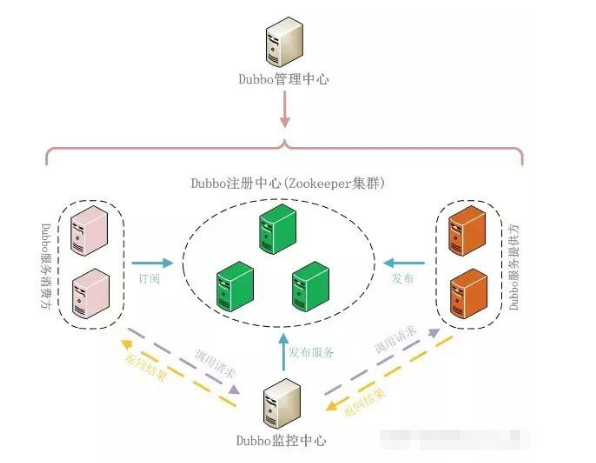
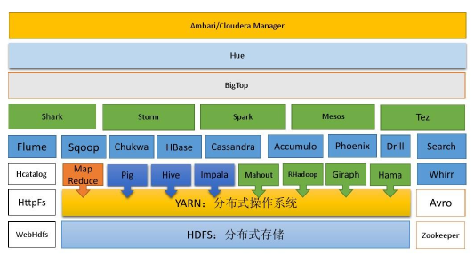
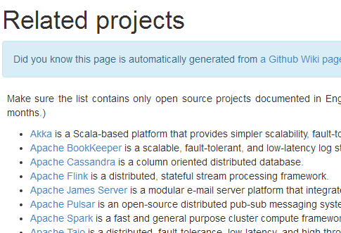

## 1.1 redis 概述

## 1.2 redis 数据结构

## 1.3 redis 持久化

### 1.3.1 RDB
### 1.3.2 AOF

### 1.3.2 游戏行业

1. 无论是手游服务端还是大型的网络游戏，`Java` 语言得到了越来越广泛的应用。
2. `Netty` 作为高性能的基础通信组件，提供了 `TCP/UDP` 和 `HTTP` 协议栈，方便定制和开发私有协议栈，账号登录服务器。
3. 地图服务器之间可以方便的通过 `Netty` 进行高性能的通信。

 

### 1.3.3 大数据领域

1. 经典的 `Hadoop` 的高性能通信和序列化组件 `Avro` 的 `RPC` 框架，默认采用 `Netty` 进行跨界点通信。
2. 它的 `NettyService` 基于 `Netty` 框架二次封装实现。

### 1.3.4 其它开源项目使用到 Netty

网址：https://netty.io/wiki/related-projects.html

## 1.4 Netty 的学习资料参考

 