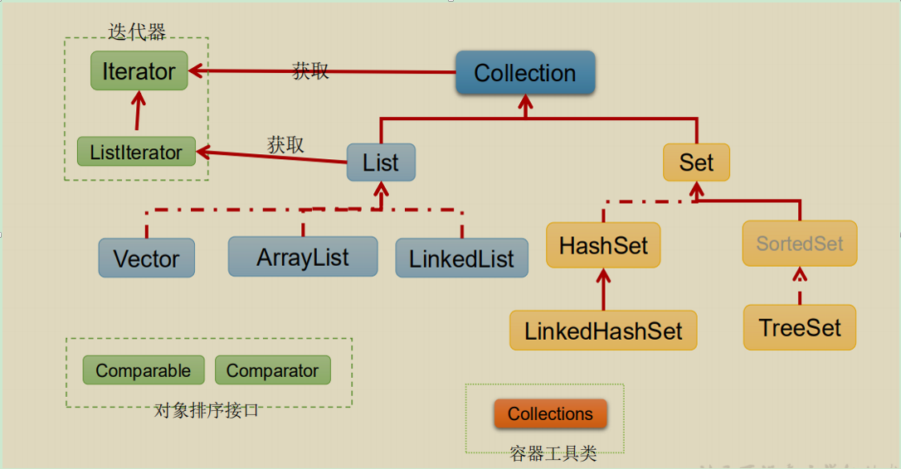

`ps: 只列出常用集合,本章节所有的代码都是基于 jdk1.8`
## 10.1 javaSe 集合框架结构

- 单列集合:
  - Collection:
    - list: 元素位置有序,可重复
      - `ArrayList`: 变长数组,底层是Object[],线程不安全,有索引,`查询快,增删慢`
      - `Vector`: 变长数组,底层是Object[],线程安全,但是效率低
      - `LinkedList`: 双向链表,底层是Node[],无索引,`查询慢,增删快`
    - set: 元素位置无序,不可重复
      - `HashSet`: 元素位置无序,不可重复,允许存放null值`(底层就是一个value固定的hashmap)`
        - LinkedHashSet: 用Node结点存放元素,形成一个双向链表,使得元素存取有序
      - `TreeSet`: 按照一定比较规则排序的set,`即元素大小有序`
  
- 双列集合:
  - Map: key-value键值对
    - `HashMap`: key不能重复,但是允许存放一个`null`key
      - LinkedHashMap: 在HashMap的基础上维护了一个双向链表,可以控制元素是存取有序还是访问有序
    - `HashTable`: 线程安全的双列集合,`但是效率不行`
    - `TreeMap`: key按照一定比较规则排序,`即键值对按照key大小有序存放`  
  
- 结构图:  
  