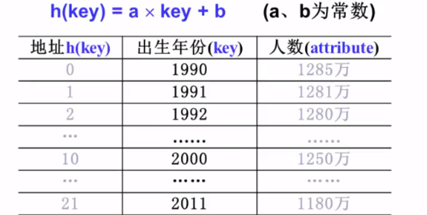
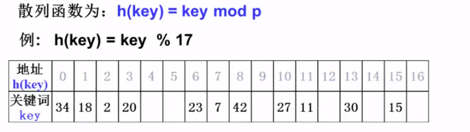
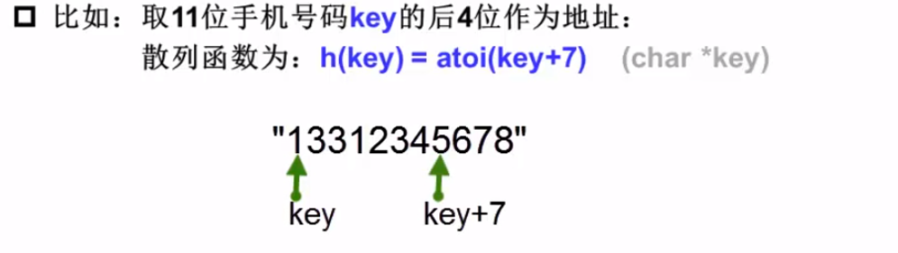
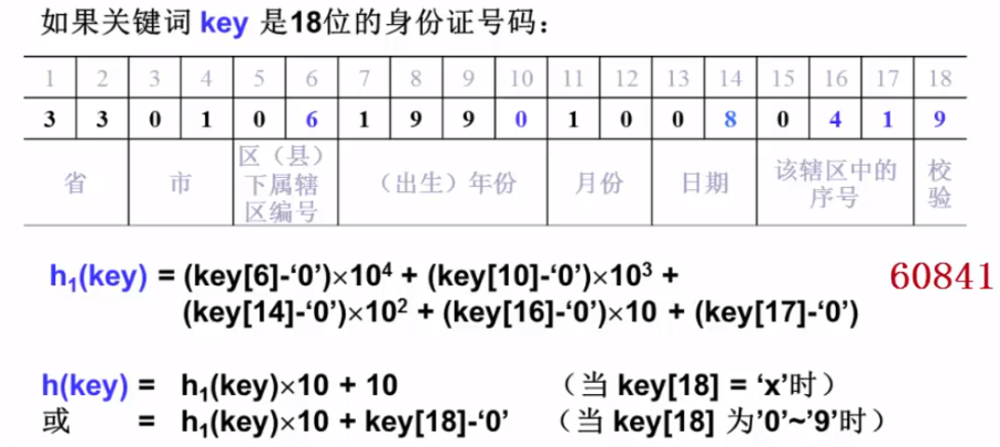
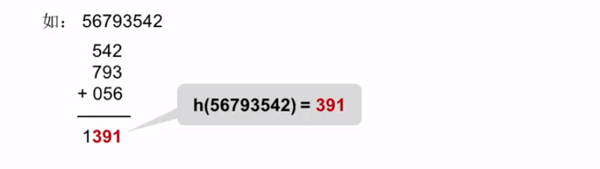
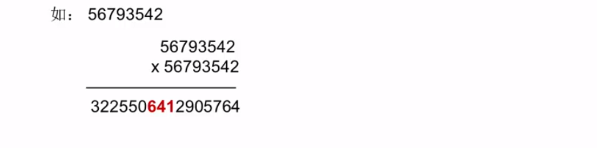
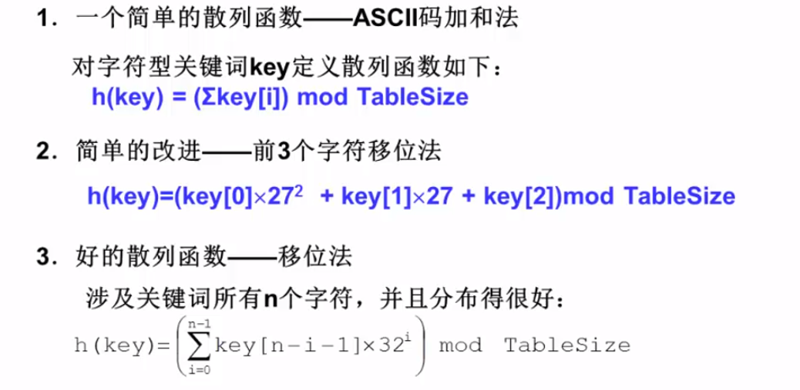
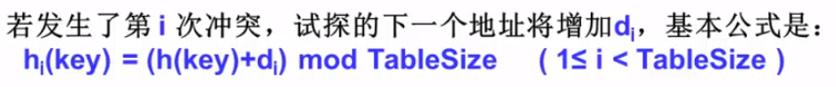
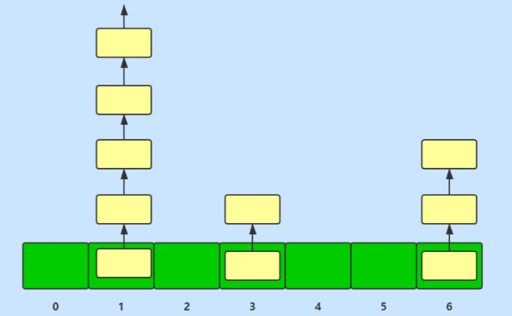

## 1. 重要属性:
1. 存放数据的结点: HashMap本质上是一个`结点数组`(就是一个数组,元素为Node类型),但是由于`hash冲突`(多个元素定位到结点数组中相同
   的位置,后面来的元素如果存放到该位置,会覆盖结点数组原有的元素)的原因,HashMap解决冲突的办法是让发生冲突的元素形成一个链表,但是
   如果链表过长会造成查询时间变慢,所以出现了将链表转化成红黑树的优化方式.因此,存储元素的结点,主要分成 `普通结点` 和 `树型结点`:
    - 普通结点:   
    ```java
    static class Node<K,V> implements Map.Entry<K,V> {
        // hash值,与计算该结点因该处于hash桶数组的哪个位置有关
        fianl int hash;
        // 存放 元素key
        fianl K key;
        // 存放 元素value
        V value;
        // 解决hash冲突使用,使hash桶链话
        Node<K,V> next;
   
        /**  ...  省略结点方法  ... */
    }
    // 父类中没有属性,只是一个借口,提供很多方法
    ```
    普通结点的属性总结:  
       |状态|类型|含义|    
       |:--|---|---|  
       | hash | int | 计算元素在结点数组中的位置相关属性 |  
       | key | 泛型K | key,可以看做是元素的唯一标志符 |
       | value | 泛型V | value,元素的值 |  
       | next | Node<K,V> | 当前结点的下一个结点,主要是将结点形成链表使用 |
     - 树型结点:  
    ```java
    static final class TreeNode<K,V> extends LinkedHashMap.Entry<K,V> {
        // 红黑树结点父结点的引用
        TreeNode<K,V> parent; 
        // 红黑树结点左儿子引用 
        TreeNode<K,V> left;
        // 红黑树结点右儿子引用
        TreeNode<K,V> right;
        // 删除后需要取消连接
        TreeNode<K,V> prev; 
        // 红黑树结点颜色
        boolean red;
        
        /**  ...  省略结点方法  ... */
    }
    // 父类 LinkedHashMap.Entry<K,V>,Entry的父类就是 上面的 普通结点
    static class Entry<K,V> extends HashMap.Node<K,V> {
        // 
        Entry<K,V> before, after;
        Entry(int hash, K key, V value, Node<K,V> next) {
            super(hash, key, value, next);
        }
    }
    ```   
    树型结点属性总结:   
       |状态|类型|含义|  
       |:--|---|---|  
       | hash | int | 计算元素在结点数组中的位置相关属性 |  
       | key | 泛型K | key,可以看做是元素的唯一标志符 |
       | value | 泛型V | value,元素的值 |  
       | next | Node<K,V> | 当前结点的下一个结点,主要是将结点形成链表使用 |
       | before | Entry<K,V> | linkedHashMap链表中指向当前结点前一个结点的引用 |  
       | next | Entry<K,V> | linkedHashMap链表中指向当前结点后一个结点的引用 |  
       | parent | TreeNode<K,V> | 红黑树父结点的引用 |  
       | left | TreeNode<K,V> | 红黑树左子结点的引用 |  
       | right | TreeNode<K,V> | 红黑树右子结点的引用 |  
       | prev | TreeNode<K,V> | 红黑树上一个结点的引用,用来删除下一个节点用的 |  
       | red | boolean | 红黑树结点颜色标记,主要是用于判断属性结构是否满足红黑树的性质 |  
   
2. 属性:  
    - `结点数组`: 又称hash桶数组  
    ```java
        // hashMap的基础结构,存放不同hash值的hash桶
        transient Node<K,V>[] table;
    ```
    > 下面提到的table就是这个节点数组
    - `结点数组默认初始化长度`:  
    ```java
       // 1 << 4 表示二进制0000000001,向左移动4位,即 1 * 2^4 = 16
       static final int DEFAULT_INITIAL_CAPACITY = 1 << 4; 
    ```
    - `结点数组最大长度`:  
    ```java
        //最大容量,必须是2^N并且小于2^30
        static final int MAXIMUM_CAPACITY = 1 << 30;
    ```  
    - `默认负载因子`: 用于判断当前结点数组中元素个数是否即将到达结点数组的容量上线,table.capacity() * 0.75 < table.size()
    的话,表示hash桶数组将要满了,需要扩容来容纳更多的hash桶
    ```java
        //在没有任何特殊指定的时候,默认负载因子为0.75f,计算下面这个属性使用的
        static final float DEFAULT_LOAD_FACTOR = 0.75f;
    ```  
    - `扩容阈值`:  
    ```java
        /*
        判断resize的阈值,即capacity * load factor,也就是扩容的阈值
        另外,如果HashMap还没有被扩容过,这个字段,就是HashMap的初始容量
        (指定初始容量构造器创建),或者0(没有指定初始容量的构造器创建)
        */
        int threshold;
    ```
    - `负载因子`: 可以手动指定负载因子是多少,用这个属性来存手动指定的负载因子
    ```java
        //负载因子
        final float loadFactor;
    ```
    - `hash桶树形化条件之一[hash链表最小要元素个数]`: 前面说过为了提高元素在hash桶(链表)中的查询速度会将链表转化成红黑树,`如果链表长度>=8`
    表示hash桶达到了树型化的条件`之一`,还要必须满足`table容量>=64` , 链表才能转化成树
    ```java
        //元素桶树形化的阈值,元素桶中元素个数>8,元素桶采用红黑树结构
        static final int TREEIFY_THRESHOLD = 8;
    ```
    - `hash桶树形化条件之一[table最小容量]`:  即使`hash链表长度>=8`了,如果这个条件没有达到也只会对`table`进行扩容.
    ```java
        //元素桶链表化的阈值,即导致元素桶树型化的元素桶数组的最小容量
        static final int MIN_TREEIFY_CAPACITY = 64;  
    ```
    - `hash桶树形化之后重新变回链表的条件[红黑树节点个数]`:    
    ```java
        //hash桶链表化的阈值,hash桶中元素个数<6,元素桶采用链表结构
        static final int UNTREEIFY_THRESHOLD = 6;    
    ```  
    - `存放key-value键值对的set`:  多用于遍历元素
    ```java
        //存放entry的set
        transient Set<Map.Entry<K,V>> entrySet;
    ```  
    - `元素个数`:  
    ```java
        //entry个数
        transient int size;
    ```  
   
## 2. Hash:  
1. 关于 `hash`:  
    - 什么是hash:  
        `hash`就是将任意长度的输入,通过一些算法将其转换成固定长度的输出,这些算法就是输入值与输出值得映射关系,通常输出值的值空间范围是远小于输入值的值空间.  
        > ps: 输出固定长度的值,指的是经过hash算法计算出来的值在某个固定长度的取值范围内,而不是指值得长度是固定的  

        举个栗子:  `拿String类的hashCode算法为例子`
        ```java
            import org.junit.Test; 
            // string的hashCode算法
            public int hashCode() {
                int var1 = this.hash;
                if (var1 == 0 && this.value.length > 0) {
                    char[] var2 = this.value;
        
                    for(int var3 = 0; var3 < this.value.length; ++var3) {
                        var1 = 31 * var1 + var2[var3];
                    }
        
                    this.hash = var1;
                }
        
                return var1;
           }

           @Test
           public void test(){
           String input1 = "abc";
           String input2 = "abcd";
           System.out.println("输入abc  输出 --> " + input1.hashCode());
           System.out.println("输入abcd  输出 --> " + input2.hashCode());
        
           }
           /**
               ps: 输出固定长度的值,指的是经过hash算法计算出来的值在某个固定长度的取值范围内,而不是指值得长度是固定的
               输入abc  输出 --> 96354
               输入abcd  输出 --> 2987074
           */
        ```
    - 什么是散列,散列函数,散列表:
        - `散列`: hash算法得到hash值,通过将hash值映射到一段连续存储空间的某个位置上并将hash值代表的元素存储在该位置上.
        - `散列函数`: 计算`hash值`与`存储位置`映射关系的函数
        - `散列表(哈希表)`: `连续的存储空间`就是`hash表(哈希表)`.   
    - 散列算法: 以h(key)表示hash算法, key表示输入
        > 好的散列算法考虑的因素: 1. 计算简单,以便提高转换的速度,2. key定位出来的存储位置应该均匀分布,尽可能减少冲突  
      
        key为数字的散列算法:
        - `直接定址法`: 取key的某种线性函数值为散列地址,即  
            
        - `除数取余法`:  用key去除以存储空间的长度,将余数作为存储key的下标,即  
              
            > ps: p就是存储空间的长度,即tableSize,通常p会取一个素数  
        - `数字分析法`: 分析数字key在各个位置的变化情况,取比较随机的位(key的某几位)作为存储key的位置
            
              
          > 1. 示例1中: (char *key)是c语言中形参的一种写法, key表示地址值(又叫指针),这个图片示例中,关键字传入的是个字符串,key则表示的是该字符串第一个字符的地址值  
          散列公式中的atoi(key+7)表示的就是指针key向后移动7位,从图上来讲就是从1的位置移动到5的位置
          > 2. 示例2中: 蓝色标记的几位数字是比较随机的,将其取出作为关键字,拼接成hash值.公式中仍然是c语言的写法,当然java中也有 
        - `折叠法`: 将key分成几段相同位数的数字,然后求和,再将结果的后几位(这个几位要与key分段的位数相同)  
              
        - `平方取中法`:  将key表示的数字去平方,然后去结果的中间几位数字作为结果  
              
        key为字符的散列算法:  
            
    - hash存在的问题:  
        由于hash算法的目的是将任意长度输入值转换成在某个固定长度的取值范围内,如果同时转换大量的输入,这个结果取值范围总有被用完的一天,就会造成两个不同的输入输出同一个输出值.
        `这种情况称为hash冲突`  
        > hash冲突是无法避免的,再优秀的hash算法也会出现hash冲突,只能尽可能的减少hash冲突  
    - 解决hash冲突的方法:  
        1. `开放地址法`:  换个位置,即当前存储位置上有元素了,就按照某种算法去尝试将元素存放到另外的位置上,通常是在hash值上加上一个`偏移量di`.`i表示第几次冲突`.  
           
           > 注意: 开放地址,定位的位置永远是 原hash值(即h(key)的结果) + di  
           
           根据d取值的不同,又分为三种方案: `线性探测`,`平方探测`,`双散列`  
             - `线性探测`: `di = i`,即偏移量就是冲突的次数,实际上就是从原来定位的位置,向后一个一个位置比较是否存在冲突. 比如:  
              第1次冲突此时定位为`下标1`,下一次定位`下标1+1`即下标2  
              第2次冲突此时定位为`下标2`,下一次定位`下标1+2`即下标3   
              第3次冲突此时定位为`下标3`,下一次定位`下标1+3`即下标4  
              线性探测存在一个问题: 元素就会聚集在一起,空间利用度不高.  
             - `平方探测`: `di = ± i^2`,表示di第一次冲突取+i^2,第二次取-i^2依次循环.比如:   
               第1次冲突此时定位为`下标5`,下一次定位`下标5+1`即下标6  
               第2次冲突此时定位为`下标6`,下一次定位`下标1-1`即下标4   
               第3次冲突此时定位为`下标4`,下一次定位`下标5+4`即下标9
               第4次冲突此时定位为`下标9`,下一次定位`下标5-4`即下标1  
             - `双散列`: `di = i * h2(key)`,重新设置一个散列函数,然后乘以冲突次数作为偏移量.  
        2. `链地址法` : 将所有发生hash冲突的元素搞成一个单向链表串联起来,`就是用一个指针去指向下一个元素的结构`  
           
2. HashMap在hash值,散列函数,冲突解决是怎么处理的.
   - 位运算:  
     - `~`运算: 取反
       一元运算符,将二进制数逐位按照规则(`1变为0,0变为1`)产生一个新的二进制数字.
     - `&`运算(与运算): 11得1  
       二元运算符,将二进制数逐位按照规则(`当对应位置上的值都是1,产生的结果在对应位置也是1`)生成一个新的二进制数字.
     - `|`运算(或运算):  有1得1
       二元运算符,将二进制数逐位按照规则(`当对应位置上只要有1,产生的结果在对应位置上就是1`)生成一个新的二进制数字.
     - `^`运算(异或运算):  相同为0,不同为1
       二元运算符,将二进制数逐位按照规则(`相同得0,不同得1`)生成一个新的二进制数字.
     - `<<`运算(左移运算):    
       `a << 2`: 将 `a`向左移动`2`位,0填充左侧因为移动空出来的位置,多余的0丢弃,   
       比如: 1 << 2, 计算过程为 0000 0001 => 0000 0100 从1变为了4  
       意义: p进制数字num向左移n位,就是将 num乘以p^n
     - `>>`运算(右移运算):
       `a >> 2`: 将 `a`向右移动`2`位,0填充左侧因为移动空出来的位置,多余的0丢弃,  
       比如: 4 >> 2, 计算过程为 0000 0100 => 0000 0001 从4变为了1
       意义: p进制数字num向右移n位,就是将 num除以p^n
   - HashMap选择的散列算法: `除数取余法`: hashCode mod p  
     在jdk1.7中散列函数算法公式为: `h(key) = hashCode % (table.length-1)`. <font color="yellow">但是模运算的效率不高.</font>   
     `为了优化计算效率`,jdk1.8 将模运算修`%`改为了位移运算`&`的等价公式,即 `h(key) = hashCode & (table.length -1)`  
     HashMap在存储空间长度,即table上面的一些限制: `HashMap限制存储元素的hash表长度总是2的n次幂大小` 
     - 默认无参构造初始化出来的table长度,默认为16: `DEFAULT_INITIAL_CAPACITY = 1 << 4`  
     - table 最大长度: `MAXIMUM_CAPACITY = 1 << 30;`,即2^30
     - 有参构造函数初始化出来的table长度,通过 `tableSizeFor(int cap)` 对其进行限制:  `总是会将table的长度设置指定table长度(假设为x)转换成比x大的最小2^n的值`
        ```java
           static final int tableSizeFor(int cap) {
                int n = cap - 1;
                n |= n >>> 1;
                n |= n >>> 2;
                n |= n >>> 4;
                n |= n >>> 8;
                n |= n >>> 16;
                return (n < 0) ? 1 : (n >= MAXIMUM_CAPACITY) ? MAXIMUM_CAPACITY : n + 1;
           }
           /**
            * tableSizeFor不同输入值输出结果的测试
            */
             @Test
             public void testTableSizeFor(){
             int[] lessThanEight = {1,2,3,4,7,8};
             int[] lessThanSixteen = {11,12,14,15,16};
             int[] lessThanThirtyTwo = {27,24,26,31,25,32};
             int[] lessThanSixtyFour = {33,43,54,61,63,64};
             System.out.println("8以下的值: ");
             for (int i : lessThanEight) {
             System.out.print(tableSizeFor(i) + " ");
             }
             System.out.println("---------------------------");
             System.out.println("16以下的值: ");
             for (int i : lessThanSixteen) {
             System.out.print(tableSizeFor(i) + " ");
             }
             System.out.println("---------------------------");
             System.out.println("32以下的值: ");
             for (int i : lessThanThirtyTwo) {
             System.out.print(tableSizeFor(i) + " ");
             }
             System.out.println("---------------------------");
             System.out.println("64以下的值: ");
             for (int i : lessThanSixtyFour) {
             System.out.print(tableSizeFor(i) + " ");
             }
             /**
               * 输出结果:
               * 8以下的值:
               * 1 2 4 4 8 8 ---------------------------
               * 16以下的值:
               * 16 16 16 16 16 ---------------------------
               * 32以下的值:
               * 32 32 32 32 32 32 ---------------------------
               * 64以下的值:
               * 64 64 64 64 64 64
                 */
             }
        ```  
     > 为什么要限制hash表的长度只能是2的n次幂:  

     原因1,`为了减少hash冲突`: 由于HashMap采取的散列算法为: `除数取余法(hashCode & table.length - 1)`. 根据`&`运算的特点: <font color=#00ff7f>对应位置全部为1结果才为1.</font>   
       - 如果`hash表长度取奇数`,那么`table.length -1`转换成二进制之后,末位一定是0,无论hashCode的值为什么值,`&`运算的结果一定是一个偶数,即`所有的元素都散列在hash表的偶数下标上`,
         除了要浪费一半的空间以外,还会造成hash冲突的增加.
       - 如果`hash表长度取偶数`,那么 `table.length - 1`转换成二进制之后,末位一定是1,当hashCode为奇数,计算结果为奇数,即`元素落在hash表的奇数下标上`,当hashCode为偶数,
         计算结果为偶数,即`元素落在hash表的偶数下标上`.换句话说: `当限定了hash表的长度为2的n次幂之后,元素的散列情况由hash值确定`  
                
     原因2: 在hash表需要扩容的时候,可以让元素要么落在原来的位置上,要么落在原来位置+原hash表长度的位置上,这样可以优化掉 `1.7版本中扩容需要rehash的问题,提高效率`.[详情见源码分析扩容部分]
   - HashMap计算hash值的算法:  
       ```java
       static final int hash(Object key) {
           int h;
           return (key == null) ? 0 : (h = key.hashCode()) ^ (h >>> 16);
       }
       ```  
       实际上HashMap在计算key对应的hash值得时候,并没有将key自身的hashCode方法返回的值作为hash值来传入散列算法中使用.  
       > 为什么不直接采用key.hashCode()计算出来的结果,作为hash值来使用: `主要是为了减少hash冲突`  
        1.将hashCode方法计算出来的值,右移16位的原因: `位运算参与运算的位数越多,产生不同结果的可能性就越大`.由于hashmap的长度在通常情况下无法让hash值得高16位参与到运算中来(hash表的长度通常都
        比较小,转换成32位的二进制的时候,高16位一般都是0,自然结果也就是0了),为了产生更多不同的结果,就将hash值高16位通过位移运算变位低16位,通过 `^`运算将其信息融合到低16位中.  
        2.高16位,低16位信息融合采用`^`的原因也是为了: `产生更多不同的结果`. `^`操作的特点是 `相同为0,不同为1,即产生结果为0或者1的可能性是50%`,相比于其他位运算操作,`^`运算得到不同结果的可能性
        更均匀,即hash值分布更均匀,这样散列函数计算出来的结果也就更均匀.  
   - HashMap在hash冲突上的解决方案:  
        - 1.7 采用的是链式地址法: 