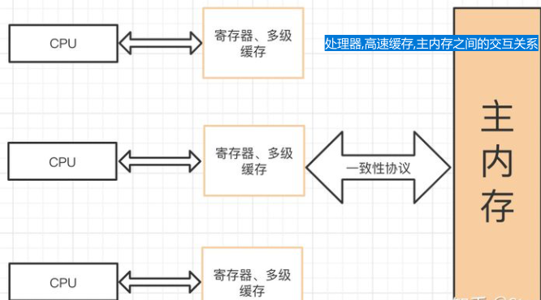
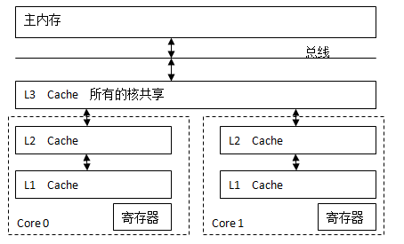
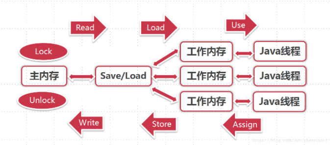

## 11.1 volatile概述
### 11.1.1 volatile是什么:
1. volatile是java虚拟机提供的轻量级的同步机制,在java中是一个关键字.
2. 三大特性:
    1. `可见性`: 某个线程对volatile修饰变量的修改,其他线程可以发现, `即线程总是获取到volatile关键字的最新值`
    2. `禁止指令重排`: cpu在不改变程序结果的情况下会对java代码运行进行顺序优化,提高执行效率,`volatile修饰变量可以禁止指令重排`
    3. `不保证原子性`: volatile是无法保证原子性  
   
### 11.1.2 java内存模型
1. 内存模型: 内存模型可以理解为`在某种特定的操作协议下,对特定的内存或者高速缓存进行读写访问过程的抽象`
   - 
   - 
2. java内存模型(JMM)是什么:
    1. java内存模型(JMM java Memory Model): 这个模型并不是真实存在的一个结构,而是一种规范,与多线程相关的一组"规范",需要每个JVM都去遵守的规范.
    2. 它解决了cpu多级缓存,处理器优化,指令重排等导致结果不可预期的问题数据,保证不同的并发语义关键字得到相应的并发安全的数据资源保护.
    3. 主要目的: 定义程序中各种变量的访问规则. `即关注在虚拟机中把变量值存储到内存和从内存中取出变量值`
      > 变量是指: 实例字段,静态字段和构成数组对象的元素, `不包括线程的局部变量,方法参数`
 
3. JMM的规定: 
   1. 所有的变量都存储在主内存中,即 `线程解锁前,必须把共享变量的值刷新回主内存`
   2. 每条线程还有自己的工作内存,工作内存中保存了变量的副本,不允许直接在主内存中对变量进行读写,即 `线程对变量的所有读写操作都只能在工作内存中完成`

4. 内存之间的交互:
   1. 基本操作: 
      
      - lock: 作用于主内存中的变量,将其标识为 `一条线程独占的状态`
      - unlock: 作用于主内存中的变量,将其从锁定状态的变量释放出来, 释放后的变量才可以被其他线程锁定
      > 主内存 -> 工作内存 -> 线程 : 
      - read: 作用于主内存中的变量,将一个变量的值从主内存中传输到线程的工作内存中,供load操作使用
      - load: 作用于工作内存中的变量,将从主内存中read到工作内存中的值,load到工作内存中的变量中
      - use: 作用于工作内存中的变量,将其值传递给执行引擎,每当虚拟机遇到一个需要使用该变量的值的指令码的时候就会执行这个操作
      > 线程 -> 工作内存 -> 主内存:
      - assign: 作用于工作内存中的变量,把从执行引擎中接收到的值,赋给工作内存中的变量,每当虚拟机遇到一个给变量赋值的指令码就会执行这个操作
      - store: 作用于工作内存中的变量,将其值传输到主内存中,供write操作使用
      - write: 作用于主内存中的变量,将从store操作得到的值存入主内存中的变量
   > 注意:
   > 1. 从主内存拷贝变量到工作内存中时,必须先read再load,可以不是连续的
   > 2. 从工作内存拷贝变量到主内存中时,必须先store在write,可以不是连续的
   2. 基本操作必须要满足的规则:
      - read和load,store和write这两组操作必须成对出现, 即 `读取了就必须加载,保存了就必须写入`
      - 不允许线程丢弃它对变量最近的一次assign,即 `变量在工作内存中被改变就必须写回主内存中`
      - 新的变量只能诞生于主内存中,不允许在工作内存中直接使用一个未被初始化(load或者assign)的变量
   ,即 `use或者store之前必须先执行load或者assign`.
      - 不允许在变量没有执行assign操作的情况下,将变量从工作内存中写入到主内存中
      - 一个变量只能被一个线程lock,且可以被该线程重复lock,多次lock之后,只有在执行了相同次数的unlock变量才会被解锁
      - 如果一个变量被lock,那么会清空工作内存中该变量的值,并且在执行引擎使用这个变量`之前必须要load或者assign`
      - 如果一个变量没有被lock,那么不能对该变量执行unlock操作,并且线程不能unlock其他线程锁定的变量.
      - 变量在unlock之前,必须store,write回主内存
   3. 未完待续