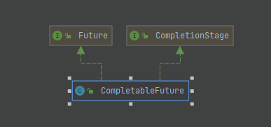

> 1. 主要介绍如何使用Completable去实现多线程的异步编排
> 2. 介绍CompletableFuture使用的时候一些注意事项
> 3. CompletableFuture常用方法介绍  

## 11.2.1 CompletableFuture概述:
1. CompletableFuture是什么?  
    1. CompletableFuture的继承关系:  
        
       从继承关系上面来看:  
       CompletableFuture实现了Future接口,那么CompletableFuture可以从执行任务中通过get方法获取结果.  
       CompletableFuture实现了CompletionStage接口,该接口从字面上理解就是完成阶段,该接口提供了许多表示任务执行在某个阶段会被
       另外一个阶段触发或者去触发其他阶段的方法,通过多个CompletionStage接口可以实现任务在不同阶段不同的功能的流转.
       
    2. CompletableFuture主要功能: 
      - 实现异步编排
      - 处理异步异常
      - 非阻塞获取某个任务的执行结果
      - 支持异步任务的链式调用
   
## 11.2.2 CompletableFuture常用方法总结:
1. 静态工厂方法创建异步任务
   - `supplyAsync`: 创建一个可以获取任务执行结果的CompletableFuture
   1. static &lt;U&gt; CompletableFuture&lt;U&gt; supplyAsync(Supplier&lt;U&gt; supplier) `不建议使用`
   2. static &lt;U&gt; CompletableFuture&lt;U&gt; supplyAsync(Supplier&lt;U&gt; supplier, Executor executor)
      ps: `U为返回值的类型,带Excutor参数表示使用自定义的线程池执行任务`,否则使用默认提供的ForkJoin.commonPool执行异步任务
   - `runAsync`: 创建一个可以获取任务执行结果的CompletableFuture
      1. static CompletableFuture<?Void> runAsync(Runnable runnable) `不建议使用`
      2. static CompletableFuture<?Void> runAsync(Runnable runnable, Executor executor)
         ps: `带Excutor参数表示使用自定义的线程池执行任务`,否则使用默认提供的ForkJoin.commonPool执行异步任务
   - `completedFuture` : 创建一个已完成的任务,并且设置结果为value
      1. static &lt;U&gt; CompletableFuture&lt;U&gt; completedFuture(U value)
   > 注意:  
   1. 由于CompletableFuture支持异步执行任务,在使用这一特性的时候需要提供一个线程池,如果不提供线程池的话就会使用其默认提供 
      的线程池(ForkJoin.commonPool),但是在其创建线程池的时候使用的是 `Runtime.getRuntime().availableProcessors() - 1` 
      即: 当前运行环境下可用的处理器数量-1(cpu核心数-1),并且所产生的线程是守护线程.
      `因此在某些处理器性能不强的环境下,不建议使用CompletableFuture默认的线程池,改为自己根据任务类型手动创建线程池`  
      - 源码: 线程池数量
      ```java
      package java.util.concurrent.ForkJoinPool
      private static ForkJoinPool makeCommonPool() {
        int parallelism = -1;
        ForkJoinWorkerThreadFactory factory = null;
        UncaughtExceptionHandler handler = null;
        try {  // ignore exceptions in accessing/parsing properties
            String pp = System.getProperty
                ("java.util.concurrent.ForkJoinPool.common.parallelism");
            String fp = System.getProperty
                ("java.util.concurrent.ForkJoinPool.common.threadFactory");
            String hp = System.getProperty
                ("java.util.concurrent.ForkJoinPool.common.exceptionHandler");
            if (pp != null)
                parallelism = Integer.parseInt(pp);
            if (fp != null)
                factory = ((ForkJoinWorkerThreadFactory)ClassLoader.
                           getSystemClassLoader().loadClass(fp).newInstance());
            if (hp != null)
                handler = ((UncaughtExceptionHandler)ClassLoader.
                           getSystemClassLoader().loadClass(hp).newInstance());
        } catch (Exception ignore) {
        }
        if (factory == null) {
            if (System.getSecurityManager() == null)
                factory = defaultForkJoinWorkerThreadFactory;
            else // use security-managed default
                factory = new InnocuousForkJoinWorkerThreadFactory();
        }
        if (parallelism < 0 && // default 1 less than #cores
            // 注意这里
            (parallelism = Runtime.getRuntime().availableProcessors() - 1) <= 0)
            parallelism = 1;
        if (parallelism > MAX_CAP)
            parallelism = MAX_CAP;
        return new ForkJoinPool(parallelism, factory, handler, LIFO_QUEUE,
                                "ForkJoinPool.commonPool-worker-");
      }
      ```
      - 守护线程:
      
      ```java
      /**
      * 验证默认线程池产生的线程是不是守护线程
      */
      @Test
      public void test(){
    
          CompletableFuture.runAsync(()->{
          System.out.println("当前线程是不是守护线程: " + Thread.currentThread().isDaemon());
          });
    
          // 防止test线程退出导致jvm退出,从而造成异步线程输出语句不打印
          try {
          Thread.sleep(1000);
          } catch (InterruptedException e) {
          e.printStackTrace();
          }
          /**
           * 当前线程是不是守护线程: true
           */
      }
      ```
   2. 关于如何估算`较为`合适的线程数量: 根据该线程池要处理的任务类型来设置线程数量 [出处](http://mng.bz/979c)
      - cpu密集型: 任务大多是由cpu进行计算的任务,设置线程数量为 cpu核心数(或者n+1) 
      - i/o密集型: 任务大量时间花费在网络i/o,磁盘i/o上,设置线程数量为 cpu核心数*2 
      `以上线程数量设置仅仅是一个估算值,要想获取最好的效率还是需要在具体环境上面进行压测,一定要压测,一定要压测,一定要压测`

2. 任务结果处理:
    - 判断任务是否执行完成:
        - boolean `isDone()` : 如果任务完成则返回ture,反之返回false
    - 获取任务结果:
        - T `get()`: `会阻塞线程`
            - 任务正常结束: 返回值就是结果;任务异常结束,会抛出对应的异常
            - 可能抛出的异常:
                - `CancellationException`: 任务被取消
                - `ExecutionException`: 任务在执行过程中抛出了异常
                - `InterruptedException`: 执行任务的线程在waiting过程中被中断  
        - T `get(long timeout, TimeUnit unit)` : `会阻塞线程`
            - 基本与get相同,只是多了一个超时异常(TimeOutException) 
        - T `join()`: `会阻塞线程`
            - 可能获取到正常的任务结果,也可能获取到任务执行中抛出的异常,任务执行过程中的异常会被封装成 CompletionException
        - T `getNow(T valueIfAbsent)` : `会阻塞线程`
            - 如果任务已经执行完成,获取任务的结果或者任务抛出的异常;如果任务没有执行完成,就返回 `valueIfAbsent`参数
            - 抛出的异常与 `join()`一样
    
3. 任务处理:
   > `任务`指的就是调用下面这些个方法的 CompletableFuture对象  
   > `取消cancel`在CompletableFuture中,被当成是异常的一种特殊形式
    - `boolean complete(T value)`
        - 尝试立即完成任务,并将任务结果设置为value,(get等方法获取到的结果就是value);
        - 如果因为调用这个方法使任务状态转换成`完成`就返回true,否则返回false
    - `boolean cancel(boolean mayInterruptIfRunning)`
        - 尝试立即取消任务,成功取消就返回true,否则返回false
        - 任务如果在未完成时被取消,任务的状态就变成了 异常结束,get()等方法会抛出CancellationException
        - 与当前任务相关联的任务,也会因为这个CancellationException而异常结束
    - `boolean isCancelled()`
        - 判断任务是否在正常结束之前,被取消掉了就返回true;否则,返回false
    - `boolean isCompletedExceptionally()`
        - 判断任务是不是异常完成
        - 不仅仅包括以下情况: cancel(),completedExceptionally()等
    - `void obtrudeValue(T value)`
        - `这个方法只是为了错误恢复场景而设置的`
        - 强制设置任务的结果,无论任务是否完成
        - 这个方法可能造成与之关联的任务的结果,也被设置为value.
    - `void obtrudeException(Throwable ex)`
        - `这个方法只是为了错误恢复场景而设置的`
        - 强制设置任务异常结束,无论任务是否完成
        - int `getNumberOfDependents()`
            - 获取有多少任务是关联着当前任务的
    
4. 任务编排:
   > `前置任务` : 是指调用下面这些方法的CompletableFuture任务,以及参数other.  
   > `新任务` : 是指下面这些方法中参数action,fn
    - 串行关系:
        - `thenRun`: 不关心前置任务的结果,只是需要等待前置任务执行完成才开始执行 新任务
            - CompletableFuture<Void> thenRun(Runnable action)
            - CompletableFuture<Void> thenRunAsync(Runnable action)
            - CompletableFuture<Void> thenRunAsync(Runnable action, Executor executor)
        - `thenAccept`: 等待前置任务执行结束之后,接收前置任务的返回值作为action的参数,执行 `新任务`,`新任务无返回值`
            - CompletableFuture<Void> thenAccept(Consumer<? super T> action)
            - CompletableFuture<Void> thenAcceptAsync(Consumer<? super T> action)
            - CompletableFuture<Void> thenAcceptAsync(Consumer<? super T> action, Executor executor)
        - `thenApply`: 等待前置任务执行结束之后,接收前置任务的返回值作为action的参数,执行 `新任务`,`新任务有返回值`
            - &lt;U&gt; CompletableFuture&lt;U&gt; thenApply(Function<? super T,? extends U> fn)
            - &lt;U&gt; CompletableFuture&lt;U&gt; thenApplyAsync(Function<? super T,? extends U> fn)
            - &lt;U&gt; CompletableFuture&lt;U&gt; thenApplyAsync(Function<? super T,? extends U> fn, Executor executor)
        - `thenCompose`: 等待前置任务执行结束之后,接收前置任务的返回值作为action的参数,执行 `新任务`,`新任务有返回值,且返回值类型为CompletionStage或其子类`
            - public &lt;U&gt; CompletableFuture&lt;U&gt; thenCompose(Function<? super T, ? extends
              CompletionStage&lt;U&gt;> fn)
            - public &lt;U&gt; CompletableFuture&lt;U&gt; thenComposeAsync(Function<? super T, ? extends
              CompletionStage&lt;U&gt;> fn)
            - public &lt;U&gt; CompletableFuture&lt;U&gt; thenComposeAsync(Function<? super T, ? extends
              CompletionStage&lt;U&gt;> fn, Executor executor)
    - 前置任务并行关系:
   ```java
   // todo 验证前置任务是不是都是并行,都是异步执行
   ```
    - 前置任务都执行完才执行新任务
        - `runAfterBoth`:
            - public CompletableFuture<Void> runAfterBoth(CompletionStage<?> other, Runnable action)
                        - public CompletableFuture<Void> runAfterBothAsync(CompletionStage<?> other, Runnable action)
            - public CompletableFuture<Void> runAfterBothAsync(CompletionStage<?> other, Runnable action, Executor
              executor)
        - `thenAcceptBoth`:
            - public &lt;U&gt; CompletableFuture<Void> thenAcceptBoth(CompletionStage<? extends U> other,BiConsumer<?
              super T, ? super U> action)
            - public &lt;U&gt; CompletableFuture<Void> thenAcceptBothAsync(CompletionStage<? extends U>
              other,BiConsumer<? super T, ? super U> action)
            - public &lt;U&gt; CompletableFuture<Void> thenAcceptBothAsync(CompletionStage<? extends U> other,
              BiConsumer<? super T, ? super U> action, Executor executor)
        - `thenCombine`:
            - public <U,V> CompletableFuture<V> thenCombine(CompletionStage<? extends U> other, BiFunction<? super T,?
              super U,? extends V> fn)
            - public <U,V> CompletableFuture<V> thenCombineAsync(CompletionStage<? extends U> other, BiFunction<? super
              T,? super U,? extends V> fn)
            - public <U,V> CompletableFuture<V> thenCombineAsync(CompletionStage<? extends U> other, BiFunction<? super
              T,? super U,? extends V> fn, Executor executor)
    - 前置任务其中一个完成执行,就执行新任务
        - `runAfterEither`
            - public CompletableFuture<Void> runAfterEither(CompletionStage<?> other, Runnable action)
            - public CompletableFuture<Void> runAfterEitherAsync(CompletionStage<?> other, Runnable action)
            - public CompletableFuture<Void> runAfterEitherAsync(CompletionStage<?> other, Runnable action, Executor
              executor)
        - `acceptEither`
            - public CompletableFuture<Void> acceptEither(CompletionStage<? extends T> other, Consumer<? super T>
              action)
            - public CompletableFuture<Void> acceptEitherAsync(CompletionStage<? extends T> other, Consumer<? super T>
              action)
            - public CompletableFuture<Void> acceptEitherAsync(CompletionStage<? extends T> other, Consumer<? super T>
              action, Executor executor)
        - `applyToEither`
            - public &lt;U&gt; CompletableFuture&lt;U&gt; applyToEither(CompletionStage<? extends T> other, Function<?
              super T, U> fn)
            - public &lt;U&gt; CompletableFuture&lt;U&gt; applyToEitherAsync(CompletionStage<? extends T> other,
              Function<? super T, U> fn)
            - public &lt;U&gt; CompletableFuture&lt;U&gt; applyToEitherAsync(CompletionStage<? extends T> other,
              Function<? super T, U> fn, Executor executor)
    - 异常处理:
        - `exceptionally`: 等价于catch,`似乎无法捕获Exception,必须通过catch捕获之后转换成CompletionException才能抛出`
            - public CompletableFuture<T> exceptionally(Function<Throwable, ? extends T> fn)
        - `handle`: 等价于finally
            - public &lt;U&gt; CompletableFuture&lt;U&gt; handle(BiFunction<? super T, Throwable, ? extends U> fn)
            - public &lt;U&gt; CompletableFuture&lt;U&gt; handleAsync(BiFunction<? super T, Throwable, ? extends U> fn)
            - public &lt;U&gt; CompletableFuture&lt;U&gt; handleAsync(BiFunction<? super T, Throwable, ? extends U> fn, Executor
              executor)
        - `whenComplete`: 等价于finally
            - public CompletableFuture<T> whenComplete(BiConsumer<? super T, ? super Throwable> action)
            - public CompletableFuture<T> whenCompleteAsync(BiConsumer<? super T, ? super Throwable> action, Executor
              executor)
            - public CompletableFuture<T> whenCompleteAsync(BiConsumer<? super T, ? super Throwable> action, Executor
              executor)
   - 多任务的简单组合:
       - `allOf`: 所有任务都完成才能执行新任务,无返回值
           - public static CompletableFuture<Void> allOf(CompletableFuture<?>... cfs)
       - `anyOf`: 所有任务完成其中一个就可以开始执行新任务 
           - public static CompletableFuture<Object> anyOf(CompletableFuture<?>... cfs)
    
## 11.2.3 实例代码
```java
// todo
```