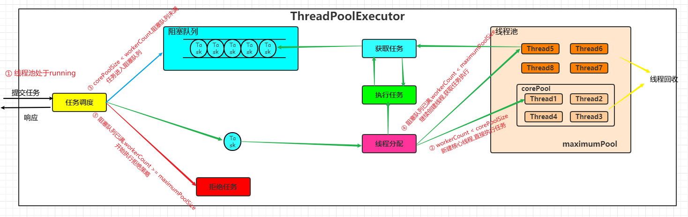

## 11.3.1 线程池是什么:
线程池是一种基于池化思想管理线程池的工具.由于线程的创建和销毁都是一个昂贵的开销,频繁创建销毁线程都会造成一定的效率损失.线程池的使用就有效的
减少了线程创建销毁带来的开销.
线程池的优点:  
1. 降低资源消耗: 通过对线程池中线程的重复利用减少线程创建与销毁造成的开销
2. 提高响应速度: 当任务到达的时候,无序等待线程创建就可以使用线程池中空闲的线程立即执行任务
3. 提高线程的可管理性: 线程是一种稀缺资源,使用线程池可以对线程统一进行分配,调优和管控.
4. 提供更多强大的功能: 例如延时定时线程池ScheduledThreadPoolExecutor，就允许任务延期执行或定期执行。
## 11.3.2 jdk1.8线程池技术组成:
1. ThreadPoolExecutor: 这个类是jdk1.8 线程池技术的核心类,其提供了创建线程池,管理线程池,监控线程池的核心api
    - 继承结构:  
    
    - Executor: 用户无需关注线程的创建和销毁,以及任务如何分配给线程,将任务提交和任务执行解耦
    - ExecutorService:   
      （1）扩充执行任务的能力，补充可以为一个或一批异步任务生成Future的方法；  
      （2）提供了管控线程池的方法，比如停止线程池的运行。
    - AbstractExecutorService: 串联任务执行流程,让用户只用关心任务本身的逻辑
    - ThreadPoolExecutor:  维护自身生命周期的同时管理线程的生命周期  
    
2. ThreadPoolExecutor核心构造方法:  其他构造方法都是在这个方法上面的缺省参数而已
   ```java
      public ThreadPoolExecutor(int corePoolSize,
                              int maximumPoolSize,
                              long keepAliveTime,
                              TimeUnit unit,
                              BlockingQueue<Runnable> workQueue,
                              ThreadFactory threadFactory,
                              RejectedExecutionHandler handler)
   ```
   参数解释:  
   - corePoolSize: 核心线程数量,可以简单的理解为常驻线程,初始数量为0.
   - maximumPoolSize: 最大线程数,线程池最多能够容纳的线程数量
   - keepAliveTime: 当池中线程数量超过核心线程数时,允许线程空闲的时长,某个线程超过这个时长,就会被关闭
   - unit: 空闲时长的单位
   - workQueue: 存放任务的阻塞队列
   - threadFactory: 线程工厂,控制产生什么样的线程,实现ThreadFactor重写newThread方法
   - handler: 拒绝策略,决定当任务数量 > 线程数+阻塞队列重量的时候,如何处理新提交上来的任务
     

3. 线程池任务的执行流程:
  
   
   1. 线程池是否还在运行: 是执行步骤2,否直接拒绝,线程池主要是保证线程池在其running状态下执行任务
   2. 提交进来的任务数量 < corePoolSize : 直接开启一个线程去执行任务,直到池中线程数到达corePoolSize 
      `注意: corePoolSize是从零开始增长的,不是线程池一来就是corePoolSize这么多个线程`
   3. corePoolSize < 任务数量 < 阻塞队列容量: 任务进入阻塞队列
   4. 阻塞队列容量 < 任务数量 < maximumPoolSize : 继续创建线程去执行任务,直到池中数量到达maximumPoolSize
   5. 任务数量 > maximumPoolSize : 开始执行拒绝策略,根据策略处理任务  
   流程图: 
        
      

4. 线程池中线程数量的增减时机:
   1. 创建线程的时机:
      1. 任务数量 < corePoolSize
      2. 阻塞队列容量 < 任务数量 < maximumPoolSize
   2. 销毁线程的时机:
      1. corePoolSize < 线程数量 < maximumPoolSize,根据 keepAliveTime参数销毁空闲时长达标的线程,直至线程数量等于corePoolSize  
      2. 销毁核心线程的时机,默认核心线程是不能被销毁的,除非线程池被销毁,但是可以通过 allowCoreThreadTimeOut方法设置允许核心线程被销毁
         - 相关API:  
         - void allowCoreThreadTimeOut(Boolean value)
            - 设置是否允许核心线程空闲太久关闭
            - 空闲太久关闭策略: 空闲时间超过keepAliveTime参数就算空闲太久,然后关闭超过时间的线程
            - value : 是否允许核心线程空闲太久关闭,true允许,false不允许
         - boolean allowCoreThreadTimeOut()
            - 查询线程池是否允许核心线程空闲太久被关闭
            - 返回值:
               - true: 线程池允许核心线程在空闲时间超过keepAlivetime参数的时候,关闭核心线程
               - false: 线程池不允许核心线程空闲太久被关闭
   
5. 阻塞队列:  
   阻塞队列的引入主要是为了将任务的提交和任务的执行进行解耦,`类似于消息队列,只不过不会限制哪个消费者消费`  
   阻塞队列的两个附加操作:  
   
      1. 队列为空,获取任务的线程会等待直到获取到任务
      2. 队列满,提交任务线程会等待到任务成功提交  
   
   几种常见的队列:  
   |阻塞队列|作用|
   |:--|---|
   | AarrayBlockingQueue   |数组实现的FIFO队列,容量有限,支持公平锁和非公平锁|
   | LinkedBlockingQueue   |链表实现的FIFO队列,默认长度限制为Integer.Max_Value.当任务处理的速度小于了任务提交的速度,造成队列无限制增长.造成资源耗尽|
   | SynchronousQueue      |一个不存储元素的阻塞队列,每个put都必须有一个take,否则无法添加元素.作为线程池的阻塞队列来说,容易造成线程数量无限制的增长,从而导致资源耗尽|
   | PriorityBlockingQueue |默认自然排序的优先级队列,同级元素无法排序|
   | DelayQueue            |实现优先级队列延迟获取元素的无界队列,如同消息队列中的延迟队列|
   | LinkendTransferQueue  |多了transfer和tryTransfer方法|
   | LinkedBlockingDeque   |链表双端队列,可以将锁的竞争最多降低到一半|
     

6. 拒绝策略:  
   ```java
      // todo
   ```
## 11.3 参考:
[Java线程池实现原理及其在美团业务中的实践](https://tech.meituan.com/2020/04/02/java-pooling-pratice-in-meituan.html)

[线程池](https://www.jianshu.com/p/c41e942bcd64)

[Java线程池ThreadPoolExecutor](https://www.cnblogs.com/study-everyday/p/6707968.html)