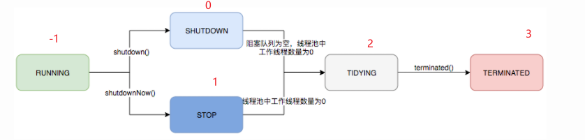

## 11.3.1 线程池是什么:
线程池是一种基于池化思想管理线程池的工具.由于线程的创建和销毁都是一个昂贵的开销,频繁创建销毁线程都会造成一定的效率损失.线程池的使用就有效的
减少了线程创建销毁带来的开销.  
线程池的优点:  
   1. 降低资源消耗: 通过对线程池中线程的重复利用减少线程创建与销毁造成的开销
   2. 提高响应速度: 当任务到达的时候,无序等待线程创建就可以使用线程池中空闲的线程立即执行任务
   3. 提高线程的可管理性: 线程是一种稀缺资源,使用线程池可以对线程统一进行分配,调优和管控.
   4. 提供更多强大的功能: 例如延时定时线程池ScheduledThreadPoolExecutor，就允许任务延期执行或定期执行。  
  

## 11.3.2 jdk1.8线程池技术组成:  
1. ThreadPoolExecutor: 这个类是jdk1.8 线程池技术的核心类,其提供了创建线程池,管理线程池,监控线程池的核心api
   - 继承结构:  
     
   - Executor: 用户无需关注线程的创建和销毁,以及任务如何分配给线程,将任务提交和任务执行解耦
   - ExecutorService:   
     （1）扩充执行任务的能力，补充可以为一个或一批异步任务生成Future的方法；  
     （2）提供了管控线程池的方法，比如停止线程池的运行。
   - AbstractExecutorService: 串联任务执行流程,让用户只用关心任务本身的逻辑
   - ThreadPoolExecutor:  维护自身生命周期的同时管理线程的生命周期

2. ThreadPoolExecutor核心构造方法:  其他构造方法都是在这个方法上面的缺省参数而已
   ```java
      public ThreadPoolExecutor(int corePoolSize,
                              int maximumPoolSize,
                              long keepAliveTime,
                              TimeUnit unit,
                              BlockingQueue<Runnable> workQueue,
                              ThreadFactory threadFactory,
                              RejectedExecutionHandler handler)
   ```
   参数解释:
   - corePoolSize: 核心线程数量,可以简单的理解为常驻线程,初始数量为0.
   - maximumPoolSize: 最大线程数,线程池最多能够容纳的线程数量
   - keepAliveTime: 当池中线程数量超过核心线程数时,允许线程空闲的时长,某个线程超过这个时长,就会被关闭
   - unit: 空闲时长的单位
   - workQueue: 存放任务的阻塞队列
   - threadFactory: 线程工厂,控制产生什么样的线程,实现ThreadFactor重写newThread方法
   - handler: 拒绝策略,决定当任务数量 > 线程数+阻塞队列重量的时候,如何处理新提交上来的任务   
   
3. 线程池生命周期:
   1. 重要参数:
      - ctl : 线程池通过一个32位原子整数封装线程池两个重要信息,一个是线程池运行状态runState,一个是当前池中线程数量  
        `final AtomicInteger ctl = new AtomicInteger(ctlOf(RUNNING, 0))`
        > 高3位存放线程池运行状态runState,后29位存放线程池数量
      - COUNT_BITS: 用来描述 原子整数ctl中29位存放线程数量信息  
        `private static final int COUNT_BITS = Integer.SIZE - 3`
      - CAPACITY :   
        `private static final int CAPACITY   = (1 << COUNT_BITS) - 1`
      - 线程池运行状态信息:
      ```java
         1. private static final int RUNNING    = -1 << COUNT_BITS; 
         2. private static final int SHUTDOWN   =  0 << COUNT_BITS;
         3. private static final int STOP       =  1 << COUNT_BITS;
         4. private static final int TIDYING    =  2 << COUNT_BITS;
         5. private static final int TERMINATED =  3 << COUNT_BITS;
      ```
      - ThreadPoolExecutor为了提高运算速度采用了位运算来剥离 runState 和 workerCount 两个参数
      ```java
         private static int runStateOf(int c)     { return c & ~CAPACITY; } 
         private static int workerCountOf(int c)  { return c & CAPACITY; }
         private static int ctlOf(int rs, int wc) { return rs | wc; }
      ```
      位运算原理如图:  
      
      |状态|含义|
      |:--|---|
      | RUNNING   |可以接受新任务,能处理队列中的任务|
      | SHUTDOWN   |不接受新任务,仍能处理队列中的任务|
      | STOP      |不接受新任务,不再处理队列中的任务,并中断正在处理中的任务|
      | TIDYING |当所有任务已经终止,工作线程数量也为0了,线程也装换到该状态,就会调用钩子方法terminated()去关闭线程池|
      | TERMINATED  |terminated()方法完成之后进入该状态|
   2. 状态流转图:  
      


4. 线程池任务的执行流程:
   

   1. 线程池是否还在运行: 是执行步骤2,否直接拒绝,线程池主要是保证线程池在其running状态下执行任务
   2. workerCount < corePoolSize : 直接开启一个线程去执行任务,直到池中线程数到达corePoolSize
      `注意: corePoolSize是从零开始增长的,不是线程池一来就是corePoolSize这么多个线程`
   3. corePoolSize < workerCount,阻塞队列未满 : 任务进入阻塞队列
   4. 阻塞队列已满,workerCount < maximumPoolSize : 继续创建线程去执行任务,直到池中数量到达maximumPoolSize
   5. 阻塞队列已满,workerCount >= maximumPoolSize : 开始执行拒绝策略,根据策略处理任务  
      流程图:  
      


5. 线程池中线程数量的增减时机:
   1. 创建线程的时机:
      1. 任务数量 < corePoolSize
      2. 阻塞队列容量 < 任务数量 < maximumPoolSize
   2. 销毁线程的时机:
      1. corePoolSize < 线程数量 < maximumPoolSize,根据 keepAliveTime参数销毁空闲时长达标的线程,直至线程数量等于corePoolSize
      2. 销毁核心线程的时机,默认核心线程是不能被销毁的,除非线程池被销毁,但是可以通过 allowCoreThreadTimeOut方法设置允许核心线程被销毁
         - 相关API:
         - void allowCoreThreadTimeOut(Boolean value)
            - 设置是否允许核心线程空闲太久关闭
            - 空闲太久关闭策略: 空闲时间超过keepAliveTime参数就算空闲太久,然后关闭超过时间的线程
            - value : 是否允许核心线程空闲太久关闭,true允许,false不允许
         - boolean allowCoreThreadTimeOut()
            - 查询线程池是否允许核心线程空闲太久被关闭
            - 返回值:
               - true: 线程池允许核心线程在空闲时间超过keepAliveTime参数的时候,关闭核心线程
               - false: 线程池不允许核心线程空闲太久被关闭
      > 注意: 当线程池还处于运行中,阻塞队列里面还有任务,并且现有线程仅剩1个的时候,线程是不允许回收的.

6. 任务管理:
   1. 任务存放: 阻塞队列存放任务  
      阻塞队列的引入主要是为了将任务的提交和任务的执行进行解耦,`类似于消息队列,只不过不会限制哪个消费者消费`  
      阻塞队列的两个附加操作:
      1. 队列为空,获取任务的线程会等待直到获取到任务
      2. 队列满,提交任务线程会等待到任务成功提交

      几种常见的队列:  
      |阻塞队列|作用|
      |:--|---|
      | ArrayBlockingQueue   |数组实现的FIFO队列,容量有限,支持公平锁和非公平锁|
      | LinkedBlockingQueue   |链表实现的FIFO队列,默认长度限制为Integer.Max_Value.当任务处理的速度小于了任务提交的速度,`造成队列无限制增长.造成资源耗尽`|
      | SynchronousQueue      |一个不存储元素的阻塞队列,每个put都必须有一个take,否则无法添加元素.作为线程池的阻塞队列来说,`容易造成线程数量无限制的增长,从而导致资源耗尽`|
      | PriorityBlockingQueue |默认自然排序的优先级队列,同级元素无法排序|
      | DelayQueue            |实现优先级队列延迟获取元素的无界队列,如同消息队列中的延迟队列|
      | LinkedTransferQueue  |多了transfer和tryTransfer方法|
      | LinkedBlockingDeque   |链表双端队列,可以将锁的竞争最多降低到一半|
      > 推荐使用: ArrayBlockingQueue根据业务场景,合理规划线程池任务容纳数量,有效利用资源,防止资源耗尽

   2. 任务分发:
      1. 任务执行的时机:
         - 直接由新创建的线程执行任务  ->  `线程数小于corePoolSize, corePoolS ize<线程数<maximumPoolSize`
         - 执行完一个任务的线程,队列中获取新任务执行 ->  `线程池开启的其他时间`
      2. 源码:
         ```java
            // 执行阻塞等待或者显示等待任务,取决于当前的设置.
            // 或者如果出现以下情况导致当前线程必须要退出的话,就返回null:
            // 1. 因为重新设置了 maximumPoolSize,导致线程超出了 maximumPoolSize
            // 2. 线程池停止(即不接受新任务,不处理任务,并中断正在执行的任务)
            // 3. 线程池关闭(不再接受新任务,可以继续处理任务)
            // 4. (设置了空闲时间)限时等待任务的线程,在回收前和回收后都是不能接受任务的,
            // 如果该线程不是池中最后一个线程,任务队列又是非空的.
            private Runnable getTask() {
                 // 通过阻塞队列的poll()(限时获取)来表示一个线程是不是超时了
                 boolean timedOut = false; // Did the last poll() time out?
         
                 for (;;) {
                     int c = ctl.get();// 获取ctl值
                     int rs = runStateOf(c);// 获取线程池的运行状态
         
                     // Check if queue empty only if necessary.
                     // 判断线程池 是否关闭,线程池是否停止运行或者阻塞队列中没有任务
                     // workQueue.isEmpty()一般都不会判断
                     if (rs >= SHUTDOWN && (rs >= STOP || workQueue.isEmpty())) {
                         decrementWorkerCount();
                         return null;
                     }
         
                     int wc = workerCountOf(c); // 获取 线程数量
         
                     // Are workers subject to culling?
                     // timed 为false 表示此时线程不会被回收
                     boolean timed = allowCoreThreadTimeOut || wc > corePoolSize;
         
                     // if条件解释:采用 了||和&&的短路特点
                     // (wc > maximumPoolSize || (timed && timedOut)
                         // 首先线程数如果大于了 maximumPoolSize,根本不需要判断线程是否要超时回收,因为这个时候是肯定需要回收的
                         // 如果 wc > maximumPoolSize 为false ,这个时候再去判断线程是否需要超时回收
                     // 如果 (wc > maximumPoolSize || (timed && timedOut)为false 就不会去做剩下的判断,直接去取任务
                     // (wc > 1 || workQueue.isEmpty()) 判断线程是否真的需要回收,当只剩下1个线程或者任务队列没有空的时候
                        // 是不会回收线程的,这个逻辑实际上是在限制当有任务存在的时候最后一个线程是不能回收的
                     if ((wc > maximumPoolSize || (timed && timedOut))
                         && (wc > 1 || workQueue.isEmpty())) {
                         if (compareAndDecrementWorkerCount(c))
                             return null;
                         continue;
                     }
         
                     try {
                         // 判断线程是否 超时就回收,true就是限时获取任务,false就直到取到任务位置
                         Runnable r = timed ?
                             workQueue.poll(keepAliveTime, TimeUnit.NANOSECONDS) :
                             workQueue.take();
                         // 取到任务就退出循环,重置线程空闲的时间.
                         if (r != null)
                             return r;
                         timedOut = true;
                     } catch (InterruptedException retry) {
                         timedOut = false;
                     }
                 }
            }
         ```
      3. 流程图:  
         


   3. 拒绝任务:
      1. 拒绝任务的时机:
         - `线程池被关闭`
         - 当提交任务数量超过 `最大线程数+阻塞队列容量` ,超过部分的任务会被拒绝执行
      2. ThreadPoolExecutor通过内部类一共提供了四种拒绝策略
         - `ThreadPoolExecutor.AbortPolicy`: 当达到执行拒绝策略的时候,就不再执行任务,而是抛出`RejectedExecutionException`异常
         > `默认拒绝策略`
         ```java
         public static class AbortPolicy implements RejectedExecutionHandler {
           
           public AbortPolicy() { }
           
           // 满足拒绝条件的时候,执行该方法
           public void rejectedExecution(Runnable r, ThreadPoolExecutor e) {
               throw new RejectedExecutionException("Task " + r.toString() +
                                                    " rejected from " +
                                                    e.toString());
           }
         }
         ```
         - `ThreadPoolExecutor.CallerRunsPolicy`: 拒绝执行任务,将任务交回给调用 execute(Runnable r)方法的线程(即提交任务的线程)来执行.
         > 特别的: 如果线程池关闭,那么该任务r 将会被抛弃  
         这个策略的目的是为了让所有任务都确保被顺利执行,`在一些要求所有任务无论什么情况都被执行时`,可以使用这个策略
         ```java
         public static class CallerRunsPolicy implements RejectedExecutionHandler {
           public CallerRunsPolicy() { }
           // 拒绝方法
           public void rejectedExecution(Runnable r, ThreadPoolExecutor e) {
               if (!e.isShutdown()) {
                   r.run();
               }
           }
         }
         ```
         - `ThreadPoolExecutor.DiscardPolicy`: 拒绝执行任务,并将任务丢弃
         > 内部的实现实际上rejectedExecution就是一个空方法体  
         由于拒绝的时候不会做任何事情,可能让我们对任务执行情况无法掌控,`所以这种拒绝策略建议使用在不重要的业务上`
         ```java
         public static class DiscardPolicy implements RejectedExecutionHandler {
           
           public DiscardPolicy() { }
           // 空方法体实现丢弃
           public void rejectedExecution(Runnable r, ThreadPoolExecutor e) {
           }
         }
         ```
         - `ThreadPoolExecutor.DiscardOldestPolicy`: 当到达拒绝条件的时候,先丢弃阻塞队列对头的任务,然后再次提交任务.
         > 线程池被关闭的话,就是丢弃任务  
         `需要考虑业务是否允许丢弃任务来决定是否使用这个策略`
         ```java
         public static class DiscardOldestPolicy implements RejectedExecutionHandler {
           
           public DiscardOldestPolicy() { }
           
           public void rejectedExecution(Runnable r, ThreadPoolExecutor e) {
               if (!e.isShutdown()) {
                   e.getQueue().poll();
                   e.execute(r);
               }
           }
         }
         ```
         - `自定义拒绝策略`:
         > 根据业务来定制符合业务逻辑的拒绝策略
         - RejectedExecutionHandler: 所有的拒绝策略都是这个接口的实现类,同样自定义拒绝策略的时候实现这个接口就行
            ```java
               public interface RejectedExecutionHandler {
               // 重写这个方法
               void rejectedExecution(Runnable r, ThreadPoolExecutor executor);
            }
            ```
   
         - 举个栗子:
            ```java
                 /*
                 * 自定义拒绝策略
                 */
               @Test
               public void test(){
                    // 由于RejectedExecutionHandler是个函数式接口,所以直接使用lambda表达式实现
                    ThreadPoolExecutor executor1 = new ThreadPoolExecutor(
                          1,
                          1,
                          1000,
                          TimeUnit.MILLISECONDS,
                          new ArrayBlockingQueue<Runnable>(10),
                          Executors.defaultThreadFactory(),
                          (r, executor) -> {// 拒绝策略
                          System.out.println("自定义拒绝策略开始了");
                          }
                    );
                    // max + queue = 11,循环提交12个任务,第十二个任务将会被拒绝
                    for (int i = 0; i < 12; i++) {
                    executor1.execute(()->{
                       try {
                       Thread.sleep(1000);
                       } catch (InterruptedException e) {
                       e.printStackTrace();
                       }
                       System.out.println("提交任务了!!");
                       });
                    }
               
                    // 防止主线程退出,不打印结果
                    try {
                    Thread.sleep(15000);
                    } catch (InterruptedException e) {
                    e.printStackTrace();
                    }
               }
            ```  
             


7. 真正的打工仔: worker
   1. 内部类worker的继承关系图以及作用 : `private final class Worker extends AbstractQueuedSynchronizer implements Runnable`  
        
      作用:
      - worker主要作用是用来控制线程运行时中断状态控制,以及其他次要属性的记录.
      - worker继承于AQS,以独占锁表示线程正在运行,防止为了唤醒等待任务的线程而中断正在执行的线程,同时也是为防止线程池的一些控制方法,
        造成正在执行的线程被中断(比如: setCorePoolSize()).
      - 真正的任务执行者: 通过内部属性firstTask,thread控制任务的执行,以及哪一个线程执行该任务.
   2. 重要参数:
      ```java
         private final class Worker extends AbstractQueuedSynchronizer implements Runnable{
            // 运行task的线程
            final Thread thread;
            // worker将要处理的任务
            Runnable firstTask;
            // 从AQS继承来的属性,state = -1表示线程正在执行.防止正在执行的线程被中断
            private volatile int state;
      }
      ```
      - `关于firstTask属性`: 在worker被创建的时候,可能带有task赋值给这个属性(创建核心线程),也可能为null(创建非核心线程)
      > 这个属性不为null的时候,创建出来的线程会立即去执行这个任务,属性为null的时候,线程就需要去任务队列中获取任务,然后执行任务.  
      可以将这个属性是否为null,看作是创建出来的线程是否需要去任务队列中获取任务的标志.  
      
         `刚创建出来的线程轨迹` :   
         
      - `关于state属性` : 这个属性是用作一个状态锁,AQS就是通过cas修改这个状态来表示资源加锁.在初始化worker的时候,将state置为-1,然后
      在与需要中断线程的时候,通过AQS中tryAcquire获取锁的时候,compareAndSetState(0, 1)去获取锁,自然无法成功获取锁,保证了正在运行的线程无法被中断
      > 注意: 这里不太好理解的是,使用AQS实现了不可重入的排他锁,并不是为了处理线程之间争用资源的场景(即不会出现线程形成阻塞队列,state也  
      不是用于判断线程的等待状态),而是保证线程在运行的时候不能被中断.
         
         `state的意义` : 
         

   3. 重要方法: 
      - 构造方法 **worker** : 
      ```java
         Worker(Runnable firstTask) {
            setState(-1); // inhibit interrupts until runWorker
            this.firstTask = firstTask;
            this.thread = getThreadFactory().newThread(this);
        }
      ```
      - 中断 **interruptIfStarted** :
        ```java
           void interruptIfStarted() {
               Thread t;
               if (getState() >= 0 && (t = thread) != null && !t.isInterrupted()) {
                   try {
                       t.interrupt();
                   } catch (SecurityException ignore) {
                   }
               }
           }
        ```
      - 锁相关方法:
        - 对外暴露的锁相关方法:
        ```java
           public void lock()        { acquire(1); }
           public boolean tryLock()  { return tryAcquire(1); }
           public void unlock()      { release(1); }
           public boolean isLocked() { return isHeldExclusively(); }
        ```
        - 获取锁 **tryAcquire** : 这个AQS加锁的真正逻辑,在对外暴露的lock方法中传入的是1作为获取到锁的显示状态
        ```java
           protected boolean tryAcquire(int unused) {
               if (compareAndSetState(0, 1)) {
                   setExclusiveOwnerThread(Thread.currentThread());
                   return true;
               }
               return false;
           }
        ```
        - 解锁 **tryRelease**:
        ```java
           protected boolean tryRelease(int unused) {
               setExclusiveOwnerThread(null);
               setState(0);
               return true;
           }
        ```
        - 判断是否持有锁 **isHeldExclusively**: state为1表示获取到独占锁,state为0表示没有获取到独占锁 
        ```java
           protected boolean isHeldExclusively() {
                return getState() != 0;
           }
        ```
   4. 添加 worker:
      - ***execute方法*** :   
      ```java
         public void execute(Runnable command) {
              if (command == null)
                  throw new NullPointerException();
              /*
               * 3个步骤:
               * 1. 如果当前线程数小于coreSize,就把command作为worker的firstTask属性,创建新线程来执行这个任务.
               * addWorker会原子的检查runState和workerCount,addWorker返回false来防止在不应该创建线程的情况
               * 下却创建了线程的错误告警
               *
               * 2. 就算一个任务可以成功的放入阻塞队列中,仍然需要再次检查是否应该添加一个线程(因为上一次检查造成现有
               * 线程的死亡),或者在进入这个方法的时候线程池是否关闭.因此我们重新检runState,如果线程池已经关闭的话,
               * 会回退已经入队的任务,或者在没有线程的时候创建一个新线程.
               *
               * 3. 如果无法存入任务到阻塞队列中,就尝试创建新线程,如果创建线程失败了,就表示线程池已经关闭或者已经饱
               * 和了,然后就会拒绝任务
               */
              int c = ctl.get();
              // 当线程数量小于核心线程的时候,通过添加work直接执行任务.
              if (workerCountOf(c) < corePoolSize) {
                  if (addWorker(command, true))
                      return;
                  c = ctl.get();
              }
              if (isRunning(c) && workQueue.offer(command)) {
                  int recheck = ctl.get();
                  if (! isRunning(recheck) && remove(command))
                      reject(command);
                  else if (workerCountOf(recheck) == 0)
                     // 非核心线程的创建
                      addWorker(null, false);
              }
              else if (!addWorker(command, false))
                  reject(command);
          }
      ```
      - ***addWorker方法*** : 
      ```java
          // 通过当前线程池的状态和指定的界限(核心线程数或者最大线程数)判断是否能够添加一个新的worker.
          // 如果可以添加线程,那么就会向线程池中添加一个新worker,然后开始执行firstTask表示的任务.
          // 如果线程池停止或者线程池正在被关闭,这个方法会返回false
          // 如果线程池工厂创建线程失败,这个方法也会返回false
          // 无论是线程工创建线程返回null,还是线程在启动过程中出现了异常,只要是创建线程失败,我们都会回滚
          private boolean addWorker(Runnable firstTask, boolean core) {
              retry: // 重试标签
              // 判断是否能够成功增加线程数量的逻辑
              for (;;) {
                  int c = ctl.get(); // 获取当前线程池的状态和线程数量信息
                  int rs = runStateOf(c);// 剥离出线程池的状态
      
                  // Check if queue empty only if necessary.
                  // 这个if的作用: 区分线程状态是处于
                  // 1. running(总是有可能创建新线程)
                      // 继续走后面的流程
                  // 2. shutDown之后(可能不会创建线程)
                      // 处于shutDown之后状态的线程池,不能处理队列中任务的,也就不会再去创建新的线程.
                      // 处于shutDown状态的线程:
                          // 拒绝新任务即firstTask == null为false(在线程数量小于corePoolSize的时候线程池状态变成了shutDown,继续提交任务就会出现这种情况)
                          // 可以继续执行队列中的任务,但是队列为空无需再创建线程去处理 即! workQueue.isEmpty() 为false,
                  if (rs >= SHUTDOWN &&
                      ! (rs == SHUTDOWN &&
                         firstTask == null &&
                         ! workQueue.isEmpty()))
                      return false;
      
                  // cas去增加worker数量的逻辑
                  for (;;) {
                      int wc = workerCountOf(c);
                      // 将核心线程池超过数量,最大线程数量越界放在一起判断了.
                      if (wc >= CAPACITY ||
                          wc >= (core ? corePoolSize : maximumPoolSize))
                          return false;
                      if (compareAndIncrementWorkerCount(c))
                          // 成功增加线程数量,不再cas增加线程数量
                          break retry;
                      c = ctl.get();  // Re-read ctl
                      if (runStateOf(c) != rs)
                          // 被其他线程抢先增加了线程数量,重新cas增加线程数量
                          continue retry;
                      // else CAS failed due to workerCount change; retry inner loop
                  }
              }
      
              boolean workerStarted = false;
              boolean workerAdded = false;
              Worker w = null;
              try {
                  w = new Worker(firstTask);
                  final Thread t = w.thread;
                  if (t != null) {
                      // 这个地方加锁,是为了防止 hashSet 出现并发安全问题
                      final ReentrantLock mainLock = this.mainLock;
                      mainLock.lock();
                      try {
                          // Recheck while holding lock.
                          // Back out on ThreadFactory failure or if
                          // shut down before lock acquired.
                          int rs = runStateOf(ctl.get());
                          // 处于running状态的线程池增加线程处理任务,或者处于shutDown状态的线程增加线程处理队列中的任务
                          if (rs < SHUTDOWN ||
                              (rs == SHUTDOWN && firstTask == null)) {
                              // 先检查线程是否已经启动
                              if (t.isAlive()) // preCheck that t is startable
                                  throw new IllegalThreadStateException();
                              workers.add(w);
                              // 保存当前线程池中线程的最大数量
                              int s = workers.size();
                              if (s > largestPoolSize)
                                  largestPoolSize = s;
                              workerAdded = true;
                          }
                      } finally {
                          mainLock.unlock();
                      }
                      // 启动线程
                      if (workerAdded) {
                          t.start();
                          workerStarted = true;
                      }
                  }
              } finally {
                  // 无论try代码是否正常执行,都要去检查线程是否成功启动
                  if (! workerStarted)
                      // 启动失败,回滚线程的创建,做了三件事:
                          // 移除线程在workers中存放的对象
                          // workerCount-1
                          // 再次检查线程是否已经终止,防止存在的线程没有被终止从而耗损资源
                      addWorkerFailed(w);
              }
              return workerStarted;
          }
      ```
      - addWorker 流程图:  
      
   5. worker执行任务:
      - run方法: run方法中没做什么事情,就是调用了runWorker方法
      - runWorker方法: 
      ```java
         // worker的主要run循环.不断的从队列中获取任务并执他,同时应对以下问题:
         // 1. work在创建的时候可能就带有任务,此时不需要再去阻塞队列里面获取任务;但是随着线程池的运行,worker就回去阻塞队列里面拿任务
         //    如果没有拿到任务,worker就会因为配置参数或者线程池状态的改变而退出.如果是因为外部代码的异常导致线程的退出,这个时候用completedAbruptly
         //    表示,则就会去执行processWorkerExit方法
         // 2. 任何任务运行前,先会获取锁,来保证任务在执行的时候不会被其他线程池中断.在执行过程中,保证当前线程不会存在中断标志的设置,除非线程池关闭
         // 3. 每一个线程在执行前都可能调用beforeExecute方法,如果在这个方法中抛出异常,就会造成线程死亡,不会执行任务,同时completedAbruptly(突然中断)
         //    被设置为true
         // 4. 假设beforeExecute()正常执行,然后就回去执行任务,在执行过程中抛出的任何异常都会传递给afterExecute().RuntimeException,Error,
         //    其他任意的throwable都是被分开处理的.由于无法在执行任务的期间重新抛出异常,这些异常都会由UncaughtExceptionHandler捕获.任何的
         //    异常都会造成线程的死亡
         // 5. 任务正常执行之后,就会调用afterExecute(),这个方法也可能产生异常,也可以造成线程的死亡.根据 JLS Sec 14.20,afterExecute()抛出
         //    的异常会生效(哪怕是task.run抛出的异常也会生效).
         final void runWorker(Worker w) {
            Thread wt = Thread.currentThread(); // 当前线程
            Runnable task = w.firstTask; // w持有的任务
            w.firstTask = null;//重置线程持有的任务
            w.unlock(); // allow interrupts
            boolean completedAbruptly = true;
            try {
               // task不为空即线程原本就持有任务 ---- 核心线程刚创建就会带有任务
               // 或者,线程原本不带有任务,通过阻塞队获取到了任务 ---- 非核心线程创建的时候就不会有任务
               while (task != null || (task = getTask()) != null) {
                  w.lock();// 加锁是为了防止线程被回收,并不是为了同步,这里就是worker实现AQS的体现
                  // If pool is stopping, ensure thread is interrupted;
                  // if not, ensure thread is not interrupted.  This
                  // requires a recheck in second case to deal with
                  // shutdownNow race while clearing interrupt
                  if ((runStateAtLeast(ctl.get(), STOP) ||
                       (Thread.interrupted() &&
                        runStateAtLeast(ctl.get(), STOP))) &&
                        !wt.isInterrupted())
                     wt.interrupt();
                  try {
                     beforeExecute(wt, task);// 空方法,留来做扩展的,在这里面run了一次任务,出来再run一次是什么效果?
                     Throwable thrown = null;
                     try {
                       task.run();
                     } catch (RuntimeException x) {
                       thrown = x; throw x;
                     } catch (Error x) {
                       thrown = x; throw x;
                     } catch (Throwable x) {
                       thrown = x; throw new Error(x);
                     } finally {
                       afterExecute(task, thrown);// 任务执行之后做什么
                     }
                  } finally {
                     task = null; // 不管任务是怎么完成的都算做完成,清空task
                     w.completedTasks++;
                     w.unlock();// 释放锁
                  }
               }
               completedAbruptly = false;
            } finally {
                processWorkerExit(w, completedAbruptly);// 线程销毁的流程
            }
         }
      ```
      - worker执行任务:  
      
   6. worker的回收:
      - 在runWorker的方法中 processWorkerExit(w,completedAbruptly)方法就是线程退出的逻辑
      - processWorkerExit(w,completedAbruptly):
      ```java
         // 清除和记录退出的线程.除非设置了completedAbruptly(执行过程出现了异常),假设修改了workerCount来记录线程的退出,
         // 否则这个方法只会被worker 线程调用.
         // 这个方法从 workerSet中移除线程,可能的话还会终止线程池,或者替换worker,比如出现下面情况其中一种
         // 1. 由于线程由于执行任务发生异常
         // 2. 如果运行中的worker少于corePoolSize,或者队列非空但是没有线程来执行
          private void processWorkerExit(Worker w, boolean completedAbruptly) {
              // 在执行过程中发生异常而退出的线程,减少workerCount后续不会再次修改workerCount
              if (completedAbruptly) // If abrupt, then workerCount wasn't adjusted
                  decrementWorkerCount();
              // 加锁处理hashset并发安全问题
              final ReentrantLock mainLock = this.mainLock;
              mainLock.lock();
              try {
                  completedTaskCount += w.completedTasks;
                  workers.remove(w);
              } finally {
                  mainLock.unlock();
              }
              // 尝试关闭线程池
              tryTerminate();
              // 下面这段逻辑实际上是在处理 允许核心线程因为空闲太久被回收的情况,保证至少有一个线程来处理任务
              int c = ctl.get();
              if (runStateLessThan(c, STOP)) {
                  if (!completedAbruptly) {
                      int min = allowCoreThreadTimeOut ? 0 : corePoolSize;
                      if (min == 0 && ! workQueue.isEmpty())
                          min = 1;
                      if (workerCountOf(c) >= min)
                          return; // replacement not needed
                  }
                  addWorker(null, false);
              }
         }
      ```
8. 线程池其他方法
   > todo
## 11.3.3 参考:
[Java线程池实现原理及其在美团业务中的实践](https://tech.meituan.com/2020/04/02/java-pooling-pratice-in-meituan.html)

[线程池](https://www.jianshu.com/p/c41e942bcd64)

[Java线程池ThreadPoolExecutor](https://www.cnblogs.com/study-everyday/p/6707968.html)

[线程池常用方法](https://www.sohu.com/a/213212378_827544)
