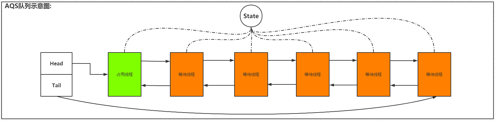

> 主要是总结一下 AQS共享锁和排他锁的原理,暂时还无法理解 AQS条件队列相关的原理(3.27)
## 11.4.1 AQS概述
1. AQS是什么:  
    1. 源码注释中是这样写的:
        - 提供一种基于 FIFO等待队列实现的阻塞锁和类似同步器的框架,并且支持对同步状态的原子管理,阻塞和唤醒线程功能.
        - AQS的子类应该用作帮助实现某种同步机制的私有内部类.AQS没有实现任何同步接口,但是实现了支撑同步接口完成同步机制的剩余步骤方法.
        - AQS支持独占式和共享式两种方式的同步机制:  
            - 独占式: 一旦某个线程拿到了共享资源,那么其他线程就无法拿到共享资源
            - 共享式: 多个线程可以共同持有资源.  
        - AQS内部定义了一个ConditionObject类,这个内部类是用来实现条件队列的
    2. 个人理解:
        - AQS是一个使用了模板方法模式的同步框架,在其内部实现了一套能够实现不同同步机制的模板方法,具体要实现什么样的同步机制,就需要根据
        同步机制特点来具体实现特定的步骤,AQS中这些特定的步骤就是以下几个方法:  
          
          AQS的子类通过实现这些方法来实现不同的同步逻辑,比如JUC包下: ReentrantLock,CountDownLatch...等
    3. AQS体系使用的继承结构:  
          
        > 通常在使用AQS框架的时候,都需要使用一个内部类来实现AQS完成某种同步机制的实现.
    4. AQS内部结构:  
        - 内部类:
            - Node: AQS实现FIFO队列的基础,一个Node结点表示一个线程
            - ConditionObject: 与AQS条件队列有关的一个内部类
        - 属性:
            - int state: 共享资源的同步状态, `取int类型: 是为了复用这个属性,不同的值有不同的含义`
            - Node head: 指向等待队列的头节点, `head结点的waitStatus一定不会是Cancelled`
            - Node Tail: 指向等待队列的尾结点, `主要作用是 等待结点入队 和 待激活节点的waitStatus为CANCELLED的时候,
              寻找队列中第一个waitStatus不为CANCELLED的结点` 
        > AQS里面还有一些属性没有列出,比如用来协助 Unsafe类CAS操作内存中head,tail,state变量的内存偏移量等.          
2. AQS核心: FIFO阻塞队列 --- CLH阻塞队列的变型
    1. 自旋锁与互斥锁:
        - 自旋锁: 一种非阻塞锁,线程不会因为没有获取到锁就阻塞等待锁的释放,而是一直处于busy-waiting状态,会一直占用cpu的执行周期,
          不断的尝试获取锁.
        - 互斥锁: 一种阻塞锁,线程会因为没有获取到锁就阻塞等待锁的释放,并且进入sleep-waiting状态,等待其他线程释放互斥量之后,由操
          作系统激活挂起的线程
        > 使用场景: 
        > 1. 自旋锁: 适用于持有锁的线程执行时间很短,短到还没有两次线程切换的时间长.
        > 2. 互斥锁: 适用于持有锁的线程执行时间很长,至少比两次线程切换的时间长.
        > 3. 单核环境下,不建议使用自旋锁.
    2. CLH锁: `AQS的阻塞队列实际上就是CLH阻塞队列的一个变型`
        1. CLH锁: 一种基于单向链表的高性能,公平的自旋锁.
        2. **CLH锁的原理**:
        > 1. 所有的线程都会包装成为一个CLH Node结点,然后通过单向链表的tail指针进入单向链表中,并且通过单向链表保存当前结点的preNode
        > 2. 自旋判断当前结点的preNode中lock标志是否被释放
        3. 代码:
        ```java
            public class ClhLock {
               /** 指向前驱结点 */
               private final ThreadLocal<ClhNode> preNode = ThreadLocal.withInitial(ClhNode::new);
               /** 指向当前结点 */
               private final ThreadLocal<ClhNode> curNode = ThreadLocal.withInitial(ClhNode::new);
               // 尾结点
               private final AtomicReference<ClhNode> tail = new AtomicReference<>(new ClhNode());
            
            
                private static class ClhNode {
                    private volatile boolean locked;
                }
            
                /**
                 * 加锁,没做重入
                 */
                public void lock() {
                    // 获取到当前结点,因为是ThreadLocal变量的关系,每个线程来获取到的都是新的item
                    final ClhNode curNode = this.curNode.get();
                    // 这就上锁了
                    curNode.locked = true;
                    // 将当前结点添加到原子引用中,并获取前驱引用(实际上就是原来的当前结点)
                    ClhNode pre = this.tail.getAndSet(curNode);
                    // 把前驱结点的引用保存到前驱结点上
                    this.preNode.set(pre);
                    // 轮训前驱结点的状态,当前驱结点的lock状态变成了false,lock方法结束,表示当前结点的lock成功,
                    while (pre.locked){
                        // 说明当前线程没有获取到锁
                        // System.out.println("线程" + Thread.currentThread().getName() + "没能获取到锁,开始自旋等待！！！");
                    }
                    // 能执行到这里，说明当前线程获取到了锁
                    //        System.out.println("线程" + Thread.currentThread().getName() + "获取到了锁！！！");
            
                }
            
                /**
                 * 解锁
                 */
                public void unlock() {
                    final ClhNode curNode = this.curNode.get();
                    curNode.locked = false;
                    this.curNode.set(this.preNode.get());
                }
            }
        ```
       *** 加锁流程图: ***  虚线表示的是 结点进入之前tail的指向
         
       > 解锁: 解锁就是自旋控制那里,一旦发现pre.lock = false了,就跳出while循环,lock()方法结束,然后去执行剩余的逻辑.  
    3. CLH自旋锁的变体: AQS阻塞队列
        1. AQS队列: 在CLH队列的基础上,AQS增加了以下几点:
            - 单向链表变成了双向链表: AQS node结点中不仅有了prev指针,还有next指针.
            - 锁资源状态属性变成了int类型: AQS的目的是让用户根据这套模板去实现不同的同步机制,为了支撑不同同步机制下复用state属性,将其设置为int
            - 未获取锁的线程不一定是一直自旋: 根据Node结点waitStatus属性的不同,节点等待时执行的操作也有可能不同.  
            `AQS队列示意图`:  
            
        
        2. AQS队列的核心: Node节点
            - 属性:
           |Node结点的属性  |作用|
           |:--           |---|
           | waitStatus   |当前结点在队列中的状态|
           | thread       |当前结点代表的线程|
           | prev         |指向当前结点的前驱结点|
           | next         |指向当前结点的后继节点|
           | nextWaiter   |指向条件队列中的下一个节点,即处于CONDITION状态的节点|
           - waitStatus属性的枚举值:
           |Node结点的属性  |作用|
           |:--           |---|
           | 0                       |表示node节点初始化的默认值|
           | int CANCELLED =  1      |表示当前线程获取锁的请求已经取消|
           | int SIGNAL    = -1      |表示后继结点已经准备好了,就等当前结点释放锁资源,然后unparking后继节点|
           | int CONDITION = -2      |表示当前结点处于条件等待队列上|
           | int PROPAGATE = -3      |表示当前结点处于共享模式下,需要向后传递state状态信息|
           - node结点的两种模式:
           |模式           |作用|
           |:--           |---|
           | Node SHARED = new Node()   |表示共享模式,在结点初始化的时候传入|
           | Node EXCLUSIVE = null      |表示独占模式,在结点初始化的时候传入|
           - 方法:
           ```java
               // 判断下一个条件结点是否是 共享模式
               final boolean isShared() {
                  return nextWaiter == SHARED;
               }
                  
                  // 前驱结点不能为null的时候使用这个方法(即检查前驱结点是否为null).可以不要null检查,现在这样做是为了协助vm的.
               final Node predecessor() throws NullPointerException {
                  Node p = prev;
                  if (p == null)
                  throw new NullPointerException();
                  else
                  return p;
               }
        
               // 用来初始化 head结点,或者创建 SHARED标记
               Node() {}
        
               // 添加等待结点时使用,mode表示 模式标记(如SHARED)
               Node(Thread thread, Node mode) {     
                   this.nextWaiter = mode;
                   this.thread = thread;
               }
        
               // 创建条件结点的时候使用
               Node(Thread thread, int waitStatus) { // Used by Condition
                   this.waitStatus = waitStatus;
                   this.thread = thread;
               }
           ```
3. AQS结构:
    1. 属性:
    |属性                             |作用|
    |:--                             |---|
    | Node head                      |等待队列的head结点,除了初始化,只能通过setHead修改这个指针,并且`如果head存在,他的waitStatus状态一定不能是 CANCELLED`|
    | Node tail                      |等待队列的tail结点,只能通过enq方法添加等待结点的时候修改|
    | volatile int state             |共享状态,不同模式下,不同值表示不同含义|
    | Thread exclusiveOwnerThread    |继承自AbstractOwnableSynchronizer,代表当前持有独占锁的线程,用于锁重入控制等|
    - state属性相关的方法:
    ```java
       int getState() { return state; } // 获取,由于volatile修饰state,获取出来的
       void setState(int newState) { state = newState; } // 设置,具有volatile的内存语义
       // 保证cas修改State.
       boolean compareAndSetState(int expect, int update) {
           return unsafe.compareAndSwapInt(this, stateOffset, expect, update);
       }
    ```
## 11.4.2 通过ReentrantLock理解基于AQS实现独占锁
## 11.4.3 通过CountDownLatch理解基于AQS实现共享锁