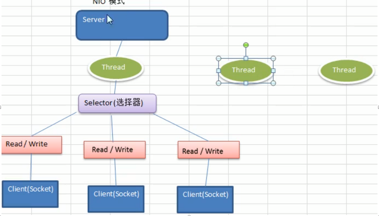
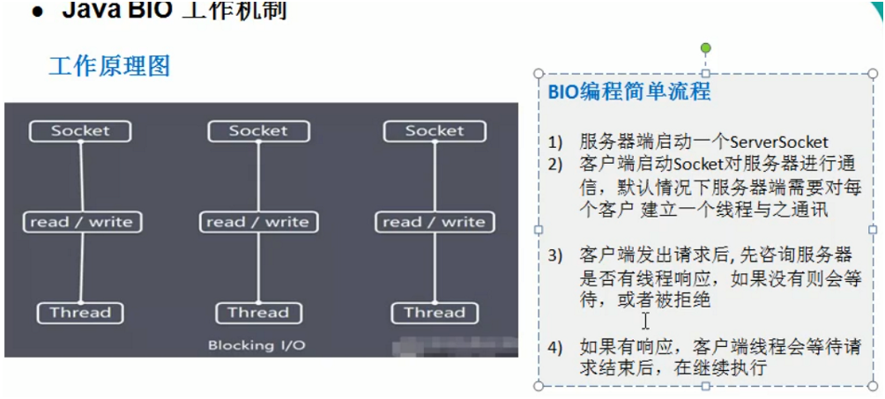
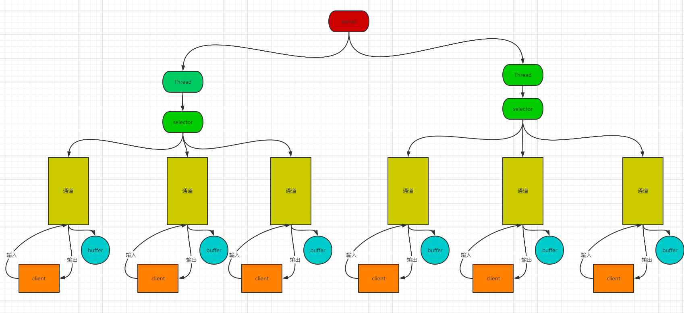

## 1. I/O模型基本介绍:

1. I/O模型的简单理解:
    1. 为了实现不同类型的i/o方式,根据应用场景采取不同数据传输的通道,对数据进行接收和发送,不同的模型对通信的性能也有不同的影响.
    2. I/O模型分类:  
       老张煮茶更为形象: [关于阻塞/非阻塞,异步/同步参考](https://www.zhihu.com/question/19732473)
        - I/O操作分两步走:  
          1.`发起I/O请求`,2.`实际的I/O读写操作(内核态和用户态的数据拷贝)`.
        - 阻塞与非阻塞:
          `阻塞与非阻塞的区别,发生在I/O操作的第一步`  
          阻塞: 当一个I/O操作发起,处理这个I/O操作的线程会一直阻塞到整个I/O处理完成,这就是阻塞I/O  
          非阻塞: 当一个I/O操作发起,处理这个I/O操作的线程不会阻塞在该I/O操作上,而是对所有的I/O操作进行轮询,只处理准备好结果的I/O操作.        
        - 同步和异步:  
          同步: 小明在泡面的过程期间,什么也不干,就一直等待到面泡好.  
          异步: 小红在泡面的过程期间,定个闹钟然后切了两个水果,冲了一杯咖啡.当闹钟响了表示面泡好了.  
          同步与异步的区别发生在I/0操作的第二步.同步I/O在实际读写的时候处理该I/O操作的进程会一直等待整个数据拷贝的过车,异步I/O则不会一直等待.
        - BIO: 同步阻塞模型,服务器实现方式为: 为每一个连接都分配一个线程专门处理这个client的请求,该连接会阻塞等待服务端的响应,如果该连接
          什么也不做的话,会造成资源的浪费和不必要的线程开销.  
          示意图:  
            
          缺点:  
          1. 如果连接空闲,容易造成资源的浪费,不必要的线程开销
          2. 高并发场景下,容易造成服务端的压力增加  
        - NIO: 同步非阻塞模型,服务端实现方式为: 一个线程(服务端可以维护多个这样的线程)处理多个client连接,通过一个多路复用器以轮询的方式去
          发现是否有连接有数据要传输,如果轮询到某个连接有数据传输就处理.对于连接是立即响应的,不会进行阻塞等待.  
          示意图: 
            
        - AIO: 异步非阻塞,AIO引入异步通道的概念,采用了Proactor模式,简化了程序编写,有效请求才启动线程,他的特点就是由操作系统处理完成后再通知
          服务端应用进程去处理,一般适用于连接较多且连接时间比较长的应用.
    3. I/O模型使用的场景:
        - BIO方式适用于连接数目比较小且固定的架构，这种方式对服务器资源要求比较高，并发局限于应用中，JDK1.4以前的唯一选择，但程序简单易理解。
        - NIO方式适用于连接数目多且连接比较短（轻操作）的架构，比如聊天服务器，弹幕系统，服务器间通讯等。编程比较复杂，JDK1.4开始支持。
        - AIO方式使用于连接数目多且连接比较长（重操作）的架构，比如相册服务器，充分调用OS参与并发操作，编程比较复杂，JDK7开始支持。  
    

## 2. JAVA BIO(传统i/o模型):

1. 基本介绍:  
    1. java BIO就是传统的 java I/O编程,其相关的接口和类在 java.io包中.
    2. BIO(blocking I/O) ： 同步阻塞，服务器实现模式为一个连接一个线程，即客户端有连接请求时服务器端就需要启动一个线程进行处理，如果这个连接
       不做任何事情会造成不必要的线程开销，可以通过线程池机制改善(实现多个客户连接服务器)。
    3. BIO方式适用于连接数目比较小且固定的架构，这种方式对服务器资源要求比较高，并发局限于应用中，JDK1.4以前的唯一选择，程序简单易理解
2. 工作机制:  
    1. 原理图:  
      
    2. 编程流程:  
        - 服务端启动ServerSocket,用于接收和响应客户端.
        - 客户端启动Socket与服务端进行通信,默认情况下,服务端会给客户端每个socket建立一个线程与之通讯.
        - 客户端发出请求后，先咨询服务器是否有线程响应，如果没有则会等待，或者被拒绝。
        - 如果有响应，客户端线程会等待请求结束后，在继续执行。
    3. BIO实例:
       > 要求:  
       使用 BIO 模型编写一个服务器端，监听 6666 端口，当有客户端连接时，就启动一个线程与之通讯。  
       要求使用线程池机制改善，可以连接多个客户端。  
       服务器端可以接收客户端发送的数据（telnet 方式即可）。  
        
        ```java
            /*
            使用线程池模拟每个请求服务端都会为之开启一个线程来处理.忽略线程池中线程数量的限制
            */
        public class BioServer {
            public static void main(String[] args) {
                // 创建线程池处理连接:
                ThreadPoolExecutor executor = new ThreadPoolExecutor(
                        10,
                        10,
                        2 * 60,
                        TimeUnit.SECONDS,
                        new ArrayBlockingQueue<Runnable>(100),
                        new ThreadFactoryBuilder().setNameFormat("BIO-THREAD-POOL-%d").build(),
                        new ThreadPoolExecutor.DiscardPolicy());
                // 打开socket连接:
                try(ServerSocket serverSocket = new ServerSocket(6666)){
                    System.out.println("成功启动socket链接");
                    while (true){
                        // 有链接过来就建立简介
                        final Socket socket = serverSocket.accept();
                        System.out.println("客户端接入");
                        // 开启 线程处理通信
                        executor.execute(()->{
                            byte[] bytes = new byte[1024];
                            // 获取输入流
                            try (
                              final InputStream inputStream = socket.getInputStream()
                            ){
                                while (true){
                                    final int read = inputStream.read(bytes);
                                    if (read != -1){
                                        System.out.println(Thread.currentThread().getName() + " : " +new String(bytes, "GBK"));
                                    }else {
                                        break;
                                    }
                                }
                            }catch (Exception e){
                                e.printStackTrace();
                            }
        
                        });
                    }
                }catch (Exception e){
                    e.printStackTrace();
                }
            }
        }
        ```  
   4. BIO的问题分析:
        - 每个请求都会创建一个线程来处理该请求.
        - 并发量较大的时候,会创建大量的线程来处理I/O请求,造成服务端的压力大,资源占用严重.
        - 建立连接之后,如果没有数据响应,那么这个线程就会被阻塞在这个I/O请求上, 造成资源的浪费.


## 3. JAVA NIO:
1. NIO基本介绍:
    1. `NIO(non-blocking i/o)`: jdk提供的一套新的i/o api,同步非阻塞模型.
    2. NIO位于jdk的java.nio包下,大多数是对java.io包中类进行了一些修改.
    3. NIO的三大核心组件: `Channel(通道)`,`Buffer(缓冲区)`,`Selector(选择器)`.  
    4. NIO是 `面向缓冲区` 或者 `面向块` 编程的.数据读取到一个它稍后处理的缓冲区,需要时可在缓冲区前后移动获取数据,这样增加了处理过程中的灵活性
    ,使用NIO可以提供非阻塞式的搞伸缩网络.  
    5. JAVA NIO的非阻塞模式:  
        - 读: 使一个线程从某个通道发送请求或者读取数据,但是他仅仅能得到当前可用数据,如果当前没有可用数据,什么都拿不到,不会阻塞保持线程阻塞.所以
    在数据准备完成之前,该线程是可以做其他事情的.
        - 写: 一个线程请求写入一些数据到某个通道,但不需要等待线程完全写入,这个线程就可以去做其他的事情.
2. NIO的原理示意图:
     
   解释:  
   1. 上图是服务端的NIO原理示意图
   2. 一个线程对应一个selector,服务端可以开启多个线程管理多个selector,然后通过一个selector去管理多个channel
   3. 一个channel对应一个buffer,一个channel就可以看做是一个连接,channel会像selector注册自己. `一个severSocketChannel和多个socketC hannel`.
   4. 一个buffer对应一个client 
   5. selector根据不同的事件,在不同事件的channel上切换,切换到哪一个channel是由事件决定的,比如: accept,read,write等事件
   6. buffer就是一个内存块,底层就是一个数组.
   7. 数据的写入读取都是通过buffer实现的.[这里就是与BIO的区别,NIO一个buffer就能解决输入与输出,BIO要么是输入,要么是输出,无法达到双向传输的效果]
    NIO只需要通过buffer的flip和clear方法就能完成读写的切换.  
   8. channel是双线的,可以返回底层操作系统的情况.比如linux底层操作系统就是双向的.
3. NIO的三大核心组件:
## 4. 实例代码: