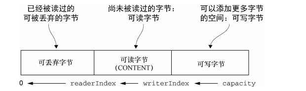
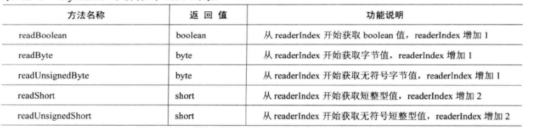
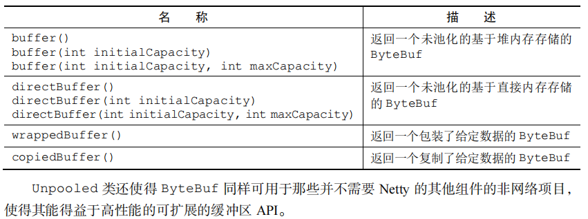
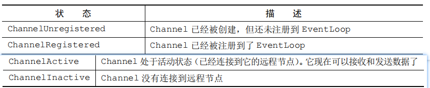

## 5.1 核心组件概述:  
1. Channel:  
   `Channel`是NIO 三大核心组件之一, Channel是输入输出硬件设备与内存之间的一个通道的抽象,channel当做是 数据传输的载体,因此 channel可以被打开或者关闭,
   可以连接或者断开连接.
2. ByteBuf:  
   `ByteBuf`是Netty在Nio的ByteBuffer基础上的扩展,Netty的核心数据容器.
3. ChannelHandler和ChannelPipeline:  
   `ChannelPipeline`: channel包裹的数据处理链,本质是个双向链表,结点元素是ChannelHandlerContext.而ChannelHandlerContext又与数据处理器 
   `ChannelHandler`关联.  
   `ChannelHandler`: 数据处理器,对数据的处理逻辑都在这个对象中完成.
4. EventLoopGroup和EventLoop:  
   `EventLoopGroup`事件循环组: 本质是一个线程池,里面的线程与`EventLoop`事件循环相关联.
5. Future和Promise:   
   `回调`: 本质是一个方法,一个指向已经被提供给其他方法的方法的引用   
   `Future`: future可以看做是一个异步操作结果的占位符,future会在未来的某一个时刻完成,并提供对一步操作结果访问的途径.  
   `Promise`: promise是对future的扩展,future本身是不提供对异步操作结果设置的途径,promise则提供了对异步操作设置结果的途径.

## 5.2 Channel:  
### 5.2.1 Channel概述:  

1. 基本的I/O操作(bind,connect,read,write)依赖于底层网络传输提供的原语(Socket).Netty提供了自己的Channel及其子类,大大的降低了直接使用socket的复杂性.
2. 通过channel可以获得当前网络连接的通道的状态
3. 通过channel可以获得当前网络连接的配置参数(比如: 接口缓冲区的大小等)
4. channel提供异步的网络I/O操作(建立连接,读写,绑定端口等),异步调用意味着任何I/O都将立即返回,并且不保证在调用结束时所有的I/O操作已经完成
5. channel支持关联I/O操作与对应的处理程序(即handler)
6. 不同的协议,不同阻塞类型的连接都有不同的channel与之对应,常见的Channel类型`不仅限与下列实现类`为:  
   |Channel实现类|解释|  
   |:--|---|  
   | NioSocketChannel   |异步的客户端TCP连接|  
   | NioServerSocketChannel   |异步的服务端TCP连接|  
   | NioDatagramChannel |异步udp连接|  
   | NioSctpChannel |异步客户端Sctp连接|  
   | NioSctpServerChannel  |异步服务端Sctp连接|  
   | OioSocketChannel  |阻塞的客户端tcp连接|  
   | EmbeddedChannel   |内置的channel 用于测试channel|  
   

### 5.2.2 Channel的层次结构、常用方法:  

### 5.2.2.1 层次结构:
   ```java
      public interface Channel extends AttributeMap, ChannelOutboundInvoker, Comparable<Channel>
   ```
     
   说明:  
   1. 每一个Channel在初始化的时候都将会被分配一个ChannelPipeLine和ChannelConfig.
   2. 每一个Channel都是独一无二的,Channel实现了java.lang.Comparable接口,从而保证了Channel的顺序.
   3. ChannelConfig包含了该channel的所有设置,并且支持了更新,可以通过`实现ChannelConfig的子类来给Channel设置某些特殊的设置`  
   4. ChannelPipeLine是实现Channel只执行I/O操作所有逻辑的容器,里面包含了许多 实际处理数据的handler了, 本质是一个 双向链表,表头表位分别表示入站出站的起点.
   5. Netty的Channel是线程安全的,所以可以使用多线程对channel进行操作
   6. 通过Channel.write()操作,数据将从链表表尾开始向链表表头移动,通过ChannelHandlerContext.write()是将数据传递给下一个ChannelHandler开始沿着链表移动.  

### 5.2.2.2 常见方法
   1. `Channel read()`: 从当前Channel中读取数据到第一个inbound缓冲区,如果数据读取成功,触发`ChannelHandler.channelRead(ChannelHandlerContext ctx,
      Object msg)事件`.`read()操作`完毕之后,紧接着触发`ChannelHandler.channelReadComplete(ChannelHandlerContext ctx)事件`.
      如果该channel读请求被挂起,后续的读操作会被忽略.
   2. `ChannelFuture write(Object msg)`: 请求将当前的msg通过ChannelPipeLine(`从pipeline的链表尾开始流动`)写入到Channel中.
      > 注意: write只是将数据存放于channel的缓冲区中,并不会将数据发送出去.要发送数据必须使用flush()方法  
      
   3. `ChannelFuture write(Object msg, ChannelPromise promise)`: 与 `方法2` 作用相同,参数 `promise`是用来写入 `write方法`的执行结果.  
   4. `ChannelFuture writeAndFlush(Object msg)`: 与 `方法2` 作用类似, 不过 `会立即将msg发送出去`  
   5. `ChannelFuture writeAndFlush(Object msg, ChannelPromise promise)`: 与 `方法4` 作用相同, 参数 `promise`是用来写入 `write方法`的执行结果.
   6. `ChannelOutboundInvoker flush()`: 将所有带发送的数据(`存放于channel缓冲区中的数据`),发送出去
   7. `ChannelFuture close()`: 关闭`channel`无论 `close`操作是成功还是失败,都会通知一次`channelFuture对象`(即触发ChannelFuture.
      operationComplete方法). `close操作`会级联触发该channel关联的`channePipeLine`中所有 `出站handler(继承了xxxOutBoundHandler)的close方法`.
      > 注意: 一旦channel 被关闭之后,就无法再使用了
   8. `ChannelFuture disconnect()`: 断开与远程通信对端的连接. `disconnect方法`会级联触发该channel关联的`channePipeLine`中所有 `出站handler(继承了xxxOutBoundHandler)的close方法`
   9. `ChannelFuture disconnect(ChannelPromise promise)`: 断开与远程通信对端的连接,并级联触发所有出站handler的`disconnect方法`,参数`promise`用于设置 
      `diaconnect方法`的执行结果.  
   10. `ChannelFuture connect(SocketAddress remoteAddress)`: 客户端使用指定的服务端地址remoteAddress发起连接请求,如果连接因为应答超时而失败,
       ChannelFuture中的 `connect方法`执行结果就是`ConnectTimeoutException`,连接被拒绝就是`ConnectException`. 
       `connection方法`会级联触发该channel关联的`pipeline`中所有`出站handler`中的`connect方法`.  
       > connect方法有很多的重载方法,可以既连接远程,又绑定本地地址等...  
   11. `ChannelFuture bind(SocketAddress localAddress)`: 绑定本地的socket地址,并级联触发所有`出站handler`中的`bind
       (ChannelHandlerContext, SocketAddress, ChannelPromise)方法`  
       > 重载方法多了一个参数 `promise`,支持对bind操作执行结果的设置  
   
   12. channel信息获取方法:  
   ```java
        ChannelConfig config() // 获取channel的配置信息,如: 连接超时时间
        ChannelMetadata metadata() // 获取channel的元数据描述信息,如TCP配置信息等
        boolean isOpen()  // channel是否已经打开
        boolean isRegistered() // channel 是否已经注册到EventLoop中
        boolean isActive() // channel是否已经处于激活状态
        boolean isWritable() // channel是否可写
        SocketAddress localAddress();  // channel本地绑定地址
        SocketAddress remoteAddress(); // channel 远程通信的远程地址
        ChannelPipeline pipeline(); // 获取channel关联的pipeline  
        ByteBufAllocator alloc(); // 获取channel缓冲区的分配对象,用于分配缓冲区大小  
        EventLoop eventLoop(); // 获取channel绑定的eventLoop(唯一分配一个I/O事件的处理线程)
        ChannelId id(); // 获取channel的唯一标识
        Channel parent();  // serverChannel.parent()返回null,socketChannel返回serverSocketChannel 
   ```  

### 5.2.2.3 Channel的工作原理: 
   TODO

## 5.3 ByteBuf:  
### 5.3.1 ByteBuf概述:  
1. ByteBuf优化:  
   NIO中ByteBuffer的缺点:  
      - `长度固定`: 一旦ByteBuffer分配完成,其容量就不能动态扩展或者收缩, 容易出现数组越界异常.
      - `操作繁琐`: ByteBuffer所有的读写操作都是基于`position`作为定位指针进行操作,读写操作切换的时候需要使用`flip()`或者`rewind()`方法
      - `功能有限`: ByteBuffer的API功能有限, 一些高级和实用的特性不支持,需要手动实现  
   
   Netty中ByteBuf的优点:  
      - 可以被用户自定义的缓冲区类型扩展
      - 通过内置的复合缓冲区实现了透明的零拷贝  
      - 容量可以按需增长(类似于StringBuilder)  
      - 读写操作使用不同的索引,读写都有专门的api无需来回切换
      - 支持方法的链式调用  
      - 支持引用计数
      - 支持池化  

### 5.3.2 ByteBuf工作原理:  
   1. ByteBuf的数据结构:  
      - `初始化时`:  
           
      - `写入部分数据之后`:  
           
      说明:  
         - ByteBuf维护了两个不同的指针: 一个用于读(readerIndex),一个用于写(writeIndex).
         - ReadIndex 和 WriteIndex 的起始位置都是数组下标为0的位置. 
         - 凡是 `read` 或者 `write`开头的api都会让 `readerIndex` 或者 `writeIndex`递增,而 `get` 或者 `set`开头的api不会.
         - ByteBuf有默认的最大长度限制 `Integter.MAX_VALUE`.在这个范围之内可以定义ByteBuf的最大容量,通过`capacity(int)
           `或者`ensureWritable(int)`方法扩容如果超出最大容量会抛出异常.
         - 试图读 `writeIndex`之后的数据,或者视图在`最大容量`之外写数据,会发生数组越界异常  
   2. ByteBuf的使用模式:  
      - `堆缓冲区`:  
        最常用模式,将数据存放在JVM的对空间里面.这种模式又被称为是 `支撑数组`.  
        `优点`: 能够在没有使用 `池化` 的情况下提供快速的分配和释放.`非常适合有遗留数据需要处理的情况`  
        `缺点`: 当需要发送堆缓冲区的数据时,JVM需要在内部把 `堆缓冲区` 中的数据复制到 `直接缓冲区`中.  
        使用示例:  
        ```java
           // 通过netty提供的工具类Unpooled获取Netty的数据容器,ByteBuf
           ByteBuf byteBuf = Unpooled.copiedBuffer("hello netty", Charset.forName("utf-8"));
   
           // 相关方法
           // public abstract boolean hasArray();判断ByteBuf的使用模式(hasArray判断的是 byteBuf是否在堆空间有一个支撑数组),
           // 即数据存放的位置在哪儿 堆/直接缓存区/复合缓冲区
           if (byteBuf.hasArray()){
               //  获取byteBuf的支撑数组
               byte[] array = byteBuf.array();
   
               // 把字节数组转换成字符串
               System.out.println( new String(array,Charset.forName("utf-8")));
   
               // 获取支撑数组的一些信息:
               // 获取支撑数组的偏移量
               System.out.println(byteBuf.arrayOffset());
               // 获取支撑数组的可读索引位置
               System.out.println(byteBuf.readerIndex());
               // 获取支撑数组的可写索引位置
               System.out.println(byteBuf.writerIndex());
               // 获取支撑数组的容量
               System.out.println(byteBuf.capacity());
               // 获取支撑数组中剩余可读元素占多少个字节,这个的大小是相对于readerIndex位置的,
               // 比如下面这个读取方法会导致readerIndex的移动,从而导致readableBytes()变化
               System.out.println(byteBuf.readByte());
               // 但是getByte方法是不会造成readerIndex移动的
               System.out.println(byteBuf.getByte(1));
               System.out.println(byteBuf.readableBytes());
           } 
        ```  
        
      - `直接缓冲区`:  
        `网络数据传输最理想的选择`,直接缓冲区中的数据是常驻在常规会被JVM进行垃圾回收的堆空间之外.
        优点: 由于数据是存储在JVM堆空间之外的直接内存中,在进行网络传输的时候,无需把数据从堆空间复制到直接内存中,提高网络传输时的性能.   
        缺点: 1.分配和释放的开销都十分昂贵;2.如果数据不仅仅是用作网络传输的数据,在服务端还可能对齐进行访问的话,必须要将数据从`直接内存`复制到`堆空间中`来.
        > 建议: 如果缓冲区中的数据,需要被访问的话,堆缓冲区是更好的选择.
        
        使用示例:  
        ```java
           ByteBuf directBuf = Unpooled.directBuffer();
           // public abstract boolean hasArray();判断ByteBuf的使用模式(hasArray判断的是 byteBuf是否在堆空间有一个支撑数组),
           // 如果不是那么就是直接缓冲区
           if (!directBuf.hasArray()){
               int len = directBuf.readableBytes();
               byte[] bytes = new byte[len];
               directBuf.getBytes(directBuf.readerIndex(),bytes);
               // 业务逻辑处理
               handleArray(bytes,0,len);
           }  
        ```

      - `复合缓冲区`:    
        `多个ByteBuf的聚合视图`,可以根据需要添加或者删除ByteBuf实例.Netty通过ByteBuf子类 --- `CompositeByteBuf`实现`复合缓冲区模式`,
        其提供一个将多个缓冲区表示为单个合并缓冲区的虚拟表示.
        > ps:  `CompositeByteBuf`中的byteBuf实例可能同时包含 `直接缓冲区`或者`非直接缓冲区`,此时`hasArray()`方法在只有一个实例的时候,回去判断该实例是否有支撑数组,
        > 存在多个实例的时候`hasArray方法`总是返回`false`

        使用示例:  模拟一个HTTP协议传输的消息,包含两部分 头部和主题,分别由不同的模块生成,在发送数据的时候进行组装.如图:`可以使用CompositeByteBuf来消除每条消息都重复创建这两个缓冲区`  
        
        ```java
            //  -------------------------------  构造 复合缓冲区  -----------------------------
            CompositeByteBuf composited = Unpooled.compositeBuffer();
            // 也可以是堆缓冲区
            ByteBuf headerBuf = Unpooled.directBuffer();
            // 也可以是直接缓冲区,buffer()返回的是一个堆缓冲区
            ByteBuf bodyBuf = Unpooled.buffer();
    
            // 添加缓冲区到复合缓冲区
            composited.addComponents(headerBuf,bodyBuf);
    
            //  .... 业务逻辑
    
            // 删除某个buf,按照添加的顺序,在本例子中,0为headBuf
            composited.removeComponent(0);
            // 遍历获取每一个buf
            for (ByteBuf buf : composited) {
                System.out.println(buf.toString());
            }   
          
            // ------------------------------  访问复合缓冲区  --------------------------------
            public static void byteBufCompositeArray() {
                CompositeByteBuf compBuf = Unpooled.compositeBuffer();
                //获得可读字节数
                int length = compBuf.readableBytes();
                //分配一个具有可读字节数长度的新数组
                byte[] array = new byte[length];
                //将字节读到该数组中
                compBuf.getBytes(compBuf.readerIndex(), array);
                //使用偏移量和长度作为参数使用该数组
                handleArray(array, 0, array.length);
            }
        ```  

### 5.3.3 字节级别操作:

工作时通常ByteBuf的数据结构图:  


### 5.3.3.1 几种不同的字节区间:

1. `可丢弃字节区间`:  
   在ByteBuf中,已经被读取过的字节都会被视为是 `可丢弃的字节`, `0`到 `readerIndex`之间就是 `可丢弃区间`,通过`discardReadBytes()`可以丢弃他们并回收空间.
   `discardReadBytes()`方法会将 `readerIndex`重新指向 `byteBuf`数组开始元素的位置,`writerIndex`会减少相应的数量.
   `discardReadBytes()`调用之后的数据结构:  
   
   > 注意:
   > 1. 由于`discardReadBytes()`方法只是移动了`writerIndex`和`可读字节`,但是没有对其他数组空间进行数据擦除,所以可写部分的数据是`没有任何保证的`.
   > 2. 在非必要时刻(内存极低紧张)的时候,不要使用 `discardReadBytes()`将`可丢弃字节区间`转化为`可写区间`,因为该方法必须将`可读区间`中的数据转移到数组开始位置去,这个操作很有可能会发生`内存复制`

2. `可读字节区间`:  
   ByteBuf的可读字节是存储实际数据的区间.`新分配`、`包装`、`复制`的缓冲区默认的`readerIndex`为`0`.  
   任何 `read` 或者 `skip` 开头的方法都会将造成`readerIndex`增加已读字节. 如果 `readBytes(ByteBuf dest)`读取并写入到`dest`会造成 `dest`的`writerIndex`
   增加相应的数量.
   > 读取 `writerIndex`之外的数据将造成数组越界异常

3. `可写字节区间`:  
   可写字节区间是指一个拥有未定义内容的,写入就绪的内存区域.`新分配`的缓冲区默认的`readerIndex`为`0`.  
   任何以 `write` 开头的方法都会造成 `writerIndex`增加以写入字节数.
   如果 `writeBytes(Bytes dest)`读取并写入到`dest` 会造成 `调用` 这个方法的缓冲区的 `readerIndex`增加相应的数量.

### 5.3.3.2 索引管理:

1. `随机访问索引`: `get或者set`开头的方法来随机`访问或者写入`数据 ByteBuf与普通数组一样,索引总是从 `0`开始,到`capacity - 1`截至.
   > 注意:
   > 1. `get或者set`开头的方法不会造成读写索引的移动
   > 2. 通过`需要索引值为入参`的方法来访问缓冲区,同样不会造成读写索引的移动
   > 3. 在需要的时候可以通过 readerIndex(index) 或者 writerIndex(index) 来移动读写索引

2. `顺序访问索引`: `read()或者write()`方法来顺序 `读取或者写入` 数据
3. `索引管理`:  
   调用 `markReaderIndex()`, `markWriterIndex()` 来标记读写索引  
   调用 `resetWriterIndex()`, `resetReaderIndex()` 来重置读写索引到标记的位置  
   调用 `readerIndex(index)`, `writerIndex(index` 来指定读写索引的位置  
   调用 `clear()` 将读写索引重新指向 `数组起始位置`  
   > 1. `clear()`方法仅仅是重置读写索引为0,不会对buf中的数据进行清除  
   > 2. 相对于 `discardReadBytes()`方法,`clear()`方法更为效率,因为它只是将读写索引重置为了0,不会引发任何的数据复制.

### 5.3.3.3 派生缓冲区:
  
派生缓冲区为ByteBuf提供以专门的方式呈现 `缓冲区数据` 的视图,常见方法为:  
- `duplicate()`: 返回一个与调用`duplicate()`的缓冲区`共享所有空间`的缓冲区  
- `slice()`: 返回调用`slice()`的缓冲区`整个可读字节区间`的切片  
- `slice(int,int)`: 返回调用`slice()`的缓冲区`部分可读字节区间`的切片
- `readSlice(int length)`: 返回调用`slice()`的缓冲区`可读字节区间中 readerIndex + length`的切片,会将`readerIndex`增加length长度.
- `order(ByteOrder)`:  
- `Unpooled.unmofifiableBuffer(..)`:  
> 注意:
> 1. 上面的方法只是将数据展示出来了,但是与原buffer使用的是同一份数据,修改派生缓冲区的数据也会改变原缓冲区的数据.(`如同ArrayList.subList`)
> 2. 如果想要复制一份独立的数据副本,请使用`copy()`,`copy(int,int)`  

测试:  
```java
        // ----------------------   非共享  -----------------------------------------

        Charset utf8 = Charset.forName("UTF-8");
        //创建 ByteBuf 以保存所提供的字符串的字节
        ByteBuf buf = Unpooled.copiedBuffer("Netty in Action rocks!", utf8);
        //创建该 ByteBuf 从索引 0 开始到索引 15 结束的分段的副本
        ByteBuf copy = buf.copy(0, 15);
        //将打印"Netty in Action"
        System.out.println(copy.toString(utf8));
        //更新索引 0 处的字节
        buf.setByte(0, (byte)'J');
        //将会成功，因为数据不是共享的
        assert buf.getByte(0) != copy.getByte(0);

        // ----------------------   共享  -----------------------------------------
        //创建一个用于保存给定字符串的字节的 ByteBuf
        ByteBuf bufForSlice = Unpooled.copiedBuffer("Netty in Action rocks!", utf8);
        //创建该 ByteBuf 从索引 0 开始到索引 15 结束的一个新切片
        ByteBuf sliced = bufForSlice.slice(0, 15);
        //将打印"Netty in Action"
        System.out.println(sliced.toString(utf8));
        //更新索引 0 处的字节
        bufForSlice.setByte(0, (byte)'J');
        //将会成功，因为数据是共享的，对其中一个所做的更改对另外一个也是可见的
        assert bufForSlice.getByte(0) == sliced.getByte(0);
```

### 5.3.3.4 查找字节所在的位置:

一般的字节可以通过 `indexOf()` 方法来查找指定的字节,或者通过传入 `ByteProcessor参数` 设定`中止字符`来配合`forEachByte()方法`帮助查找.
```java
    /**
     * Aborts on a {@code NUL (0x00)}.
     */
    ByteProcessor FIND_NUL = new IndexOfProcessor((byte) 0);

    /**
     * Aborts on a non-{@code NUL (0x00)}.
     */
    ByteProcessor FIND_NON_NUL = new IndexNotOfProcessor((byte) 0);

    /**
     * Aborts on a {@code CR ('\r')}.
     */
    ByteProcessor FIND_CR = new IndexOfProcessor(CARRIAGE_RETURN);

    /**
     * Aborts on a non-{@code CR ('\r')}.
     */
    ByteProcessor FIND_NON_CR = new IndexNotOfProcessor(CARRIAGE_RETURN);

    /**
     * Aborts on a {@code LF ('\n')}.
     */
    ByteProcessor FIND_LF = new IndexOfProcessor(LINE_FEED);

    /**
     * Aborts on a non-{@code LF ('\n')}.
     */
    ByteProcessor FIND_NON_LF = new IndexNotOfProcessor(LINE_FEED);

    /**
     * Aborts on a semicolon {@code (';')}.
     */
    ByteProcessor FIND_SEMI_COLON = new IndexOfProcessor((byte) ';');

    /**
     * Aborts on a comma {@code (',')}.
     */
    ByteProcessor FIND_COMMA = new IndexOfProcessor((byte) ',');

    /**
     * Aborts on a ascii space character ({@code ' '}).
     */
    ByteProcessor FIND_ASCII_SPACE = new IndexOfProcessor(SPACE);

    /**
     * Aborts on a {@code CR ('\r')} or a {@code LF ('\n')}.
     */
    ByteProcessor FIND_CRLF = new ByteProcessor() {
        @Override
        public boolean process(byte value) {
            return value != CARRIAGE_RETURN && value != LINE_FEED;
        }
    };

    /**
     * Aborts on a byte which is neither a {@code CR ('\r')} nor a {@code LF ('\n')}.
     */
    ByteProcessor FIND_NON_CRLF = new ByteProcessor() {
        @Override
        public boolean process(byte value) {
            return value == CARRIAGE_RETURN || value == LINE_FEED;
        }
    };

    /**
     * Aborts on a linear whitespace (a ({@code ' '} or a {@code '\t'}).
     */
    ByteProcessor FIND_LINEAR_WHITESPACE = new ByteProcessor() {
        @Override
        public boolean process(byte value) {
            return value != SPACE && value != HTAB;
        }
    };

    /**
     * Aborts on a byte which is not a linear whitespace (neither {@code ' '} nor {@code '\t'}).
     */
    ByteProcessor FIND_NON_LINEAR_WHITESPACE = new ByteProcessor() {
        @Override
        public boolean process(byte value) {
            return value == SPACE || value == HTAB;
        }
    };
```

### 5.3.4 ByteBuf常见API总结:  

### 5.3.4.1 顺序读操作:  
   
   
   
     

### 5.3.4.2 顺序写操作:  
   
   
   
   

### 5.3.4.3 随机写操作:  
     

### 5.3.4.4 随机读操作:  
   

### 5.3.4.5 其他操作:  
   

### 5.3.5 ByteBuf辅助工具类:

### 5.3.5.1 ByteBufHolder接口:   
`ByteBufHolder`是`ByteBuf`的容器,除了实际数据装载之外,我们还需要存储各种属性值.比如HTTP的请求和响应都可以携带消息体,在Netty中消息体就是用`ByteBuf`来表示;
但是由于不同的协议之间会包含不同的协议字段和功能,这部分数据并不适合写在实际数据中,所以Netty抽象出了一个 `ByteBufHolder接口`持有一个`ByteBuf`用以装载实际数据,
同时携带不同协议的协议字段和功能. (ByteBufHolder的实现类实现不同协议的协议字段和功能描述).  
  
说明:  
- `ByteBufHolder`为Netty的高级特性提供了支持,比如缓冲区池化,其中可以从池中借用ByteBuf,并且在需要时自动释放.  
- `通常用作需要存储实际数据的消息对象接口`
- `常用方法`:  
     

### 5.3.5.2 ByteBuf内存空间分配:  

1. `按需分配 --- ByteBufAllocator接口`:  
    1. 为了降低分配和释放的内存开销,Netty通过`interface ByteBufAllocator`实现了缓冲区池化,`ByteBufAllocator`可以用来分配我们所描述过得任意类型的ByteBuf实例.
    `池化`不会改变`ByteBuf`api 的语义,只是新的数据需要使用ByteBuf来存储的时候,可以从缓冲池中取出一个 `ByteBuf实例` 来存储数据.
    2. 常用方法:  
         
       
    3. 说明:  
        - 可以通过 `channel`(每个都可以有一个不同的ByteBufAllocator实例) 或者 绑定到 
          `channelHandler`的`ChannelHandlerContext`获取到一个`ByteBufAllocator`的引用.  
        - Netty提供了  ByteBufAllocator 的实现:  
          `PooledByteBufAllocator`:  池化ByteBuf实例,提高性能并最大限度的减少内存碎片.使用的是jemalloc技术实现的内存分配.
          `UnpooledByteBufAllocator`:  非池化ByteBuf实例分配,每一次调用都会返回一个新的byteBuf实例.  
          > 1. netty4.1版本默认使用的是 `PooledByteBufAllocator`, 4.0版本默认使用的则是 `UnpooledByteBufAllocator`.
          > 2. 可以通过`ChannelConfig`或者`Bootstrap`配置 使用什么类型的 `ByteBufAllocator`.
        - `ioBuffer()`: 这个方法在使用的时候,如果当前运行环境有 sun.misc.Unsafe 支持的时候, 返回的是 `Direct ByteBuf`,否则返回的是 `Heap ByteBuf`.  
          当使用 `PreferHeapByteBufAllocator`的时候, 只会返回 `Heap ByteBuf`.
          
2. `Unpooled缓冲区`:  
在某些情况下,如果未能获取到一个 `ByteBufAllocator`的引用.可以通过工具类 `Unpooled` 来创建未池化的 `ByteBuf实例`.
  

3. `ByteBufUtil类`:  
   `ByteBufUtil` 提供了用于操作 `ByteBuf` 的静态的辅助方法。因为这个API是通用的，并且和池化无关，所以这些方法已然在分配类的外部实现。
   这些静态方法中最有价值的可能就是 hexdump()方法，它以十六进制的表示形式输出`ByteBuf` 的内容。这在各种情况下都很有用，例如，出于调试的目的记录 `ByteBuf` 的内容。十
   六进制的表示通常会提供一个比字节值的直接表示形式更加有用的日志条目，此外，十六进制的版本还可以很容易地转换回实际的字节表示。
   另一个有用的方法是 `boolean equals(ByteBuf, ByteBuf)`，它被用来判断两个 `ByteBuf`实例的相等性。

### 5.3.6 引用计数:  

- `引用计数`: 一种通过在某个对象所持有的资源不再被其他对象引用时,释放该对象所持有的资源来优化内存使用和性能的技术.(`类似于JVM的引用计数算法`)  
- Netty 在第 4 版中为 `ByteBuf` 和 `ByteBufHolder` 引入了引用计数技术，它们都实现了 `interface ReferenceCounted`.  
- `引用计数实现的大致思路`: 它主要涉及跟踪到某个特定对象的活动引用的数量。一个 `ReferenceCounted` 实现的实例将通常以活动的引用计数为 `1`作为开始。只要`引用计
  数`大于 `0`，就能保证对象不会被释放。当活动引用的数量减少到 0 时，该实例就会被释放。
  > 注意: 虽然释放的确切语义可能是特定于实现的，但是至少已经释放的对象应该不可再用了。
- `引用计数`对于 `池化实现`（如 PooledByteBufAllocator）来说是至关重要的，它降低了内存分配的开销。
- 试图访问一个已经被`释放(或者说是 引用计数为 0)`的引用计数的对象，将会导致一个 `IllegalReferenceCountException`。  
- `谁来释放`: 一般是由 最后访问资源的一方 来负责释放 资源.  
> 一个特定的（ReferenceCounted 的实现）类，可以用它自己的独特方式来定义它的引用计数规则。例如，我们可以设想一个类，其 `release()` 方法的实现总是将引用计数设为
零，而不用关心它的当前值，从而一次性地使所有的活动引用都失效。  


### 5.3.7 ByteBuf源码分析:  

TODO


## 5.4 ChannelHandler和ChannelPipeline:  

### 5.4.1 ChannelHandler和ChannelPipeline的概述:  
`Channel,ChannelPipeline,ChannelContext,ChannelHandler之间的关系`:  


Netty的ChannelPipeline和ChannelHandler机制类似于Servlet和Filter过滤器,这类拦截器实际上是责任链模式的一种变形,主要是为了方便事件的拦截和用户业务逻辑的定制.  
`ChannelHandler`: 从应用程序开发人员的角度来看,Netty的主要组件是ChannelHandler,它充当了所有处理入站和出站数据的应用程序逻辑的容器,ChannelHandler可以适用于任何逻辑操作.  
`ChannelPipeline`: Netty将Channel的数据管道抽象为 `ChannelPipeline`,消息在 `ChannelPipeline`中流动和传递.
`ChannelPipeline`持有I/O事件拦截器`ChannelHandler`的链表, 由 `ChannelHandler` 对I/O事件进行拦截和处理,可以方便的通过增删handler来实现不同业务逻辑的定制,不需要对已有
handler修改,就能实现对修改封闭和对扩展的支持.  
`ChannelHandlerContext`: 当`ChannelHandler`每一次被分配到一个`ChannelPipeline`的时候,都会创建一个新的 
`ChannelHandlerContext`与`ChannelHandler`关联起来,其表示`ChannelHandler`与`ChannelPipeline`的绑定关系.

### 5.4.2 ChannelHandler:  

#### 5.4.2.1 ChannelHandler相关接口:
1. Channel的生命周期:  
    `Channel`接口定义了一组和 `ChannelInBoundHandler`api 密切相关的简单但是功能强大的状态模型.`Channel的4个状态` :  
    
    说明:  
    - 只要`Channel`没有关闭,`Channel`就可以再次被注册到`EventLoop`组件上.
    - 当图片中的状态一旦发生改变的时候,就会生成对应的事件,这些事件会被转发给 `ChannelPipeline` 中的 `ChannelHandler`处理.  
2. ChannelHandler的生命周期:  
    

## 5.5 EventLoopGroup和EventLoop:  
## 5.6 Future和Promise:
